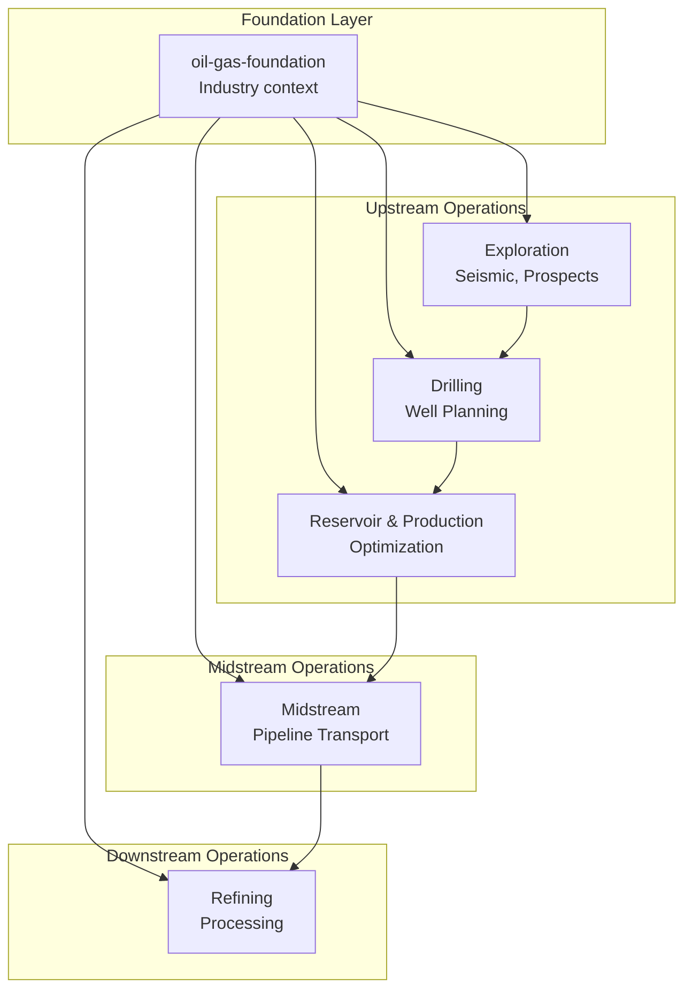

# PetroPowers

AI skills framework for petroleum engineering workflows. Specialized domain expertise for oil & gas operations.

PetroPowers combines proven software development workflows with deep oil & gas domain knowledge, enabling coding agents to understand industry terminology, work with professional data formats, and follow domain-specific best practices.

## Why PetroPowers?

PetroPowers combines proven software development workflows with deep domain expertise:

- **General engineering skills** - TDD, debugging, planning, code review
- **Oil & gas domain skills** - Exploration, drilling, reservoir, midstream, refining workflows
- **Intelligent delegation** - Domain tasks stay in domain skills; software tasks route to development workflows

**For petroleum engineers:** AI understands your workflows, data formats, and safety culture.

**For AI engineers:** Build robust oil & gas applications with domain-informed agents.

**For both:** Work seamlessly between domain analysis and software development.

## How it works

It starts from the moment you fire up your coding agent. As soon as it sees that you're building something, it *doesn't* just jump into trying to write code. Instead, it steps back and asks you what you're really trying to do. 

Once it's teased a spec out of the conversation, it shows it to you in chunks short enough to actually read and digest. 

After you've signed off on the design, your agent puts together an implementation plan that's clear enough for an enthusiastic junior engineer with poor taste, no judgement, no project context, and an aversion to testing to follow. It emphasizes true red/green TDD, YAGNI (You Aren't Gonna Need It), and DRY. 

Next up, once you say "go", it launches a *subagent-driven-development* process, having agents work through each engineering task, inspecting and reviewing their work, and continuing forward. It's not uncommon for Claude to be able to work autonomously for a couple hours at a time without deviating from the plan you put together.

There's more to it, but that's the core of the system. And because the skills trigger automatically, you don't need to do anything special. Your coding agent just has PetroPowers.

**For domain work, it works differently:**

When you ask "Calculate porosity from this density log," PetroPowers:
1. Routes to domain skill (well-log-analysis)
2. Loads LAS file, applies petrophysical equations  
3. Returns domain results (porosity, saturation, lithology)

When you ask "Build a drilling monitoring dashboard," PetroPowers:
1. Detects software development task
2. Delegates to development workflow (brainstorming → TDD)
3. Builds deployment-ready web application
4. Returns to domain context when complete

## Maintainers

PetroPowers is maintained by [Andrii Kucherenko](https://github.com/kucherenko).


## Installation

PetroPowers includes general development skills plus oil & gas domain specialization.

### Prerequisites

- One of: Claude Code, Cursor, Codex, OpenCode, or Gemini CLI
- Understanding of petroleum engineering workflows (for domain skills)

**Note:** Installation differs by platform. Claude Code and Cursor have built-in plugin marketplaces. Codex and OpenCode require manual setup.

See [docs/future-plans.md](docs/future-plans.md) for planned marketplace integrations (Claude Code Official, Claude Code via Marketplace, Cursor).

### Codex

Tell Codex:

```
Fetch and follow instructions from https://raw.githubusercontent.com/kucherenko/petropowers/refs/heads/main/.codex/INSTALL.md
```

**Detailed docs:** [docs/README.codex.md](docs/README.codex.md)

### OpenCode

Tell OpenCode:

```
Fetch and follow instructions from https://raw.githubusercontent.com/kucherenko/petropowers/refs/heads/main/.opencode/INSTALL.md
```

**Detailed docs:** [docs/README.opencode.md](docs/README.opencode.md)

### Verify Installation

Start a new session in your chosen platform and ask for something that should trigger a skill (for example, "analyze this well log" or "help me plan this drilling dashboard"). The agent should automatically invoke the relevant petropowers skill.

## The Basic Workflow

### Software Development Workflow

1. **brainstorming** - Activates before writing code. Refines rough ideas through questions, explores alternatives, presents design in sections for validation. Saves design document.

2. **using-git-worktrees** - Activates after design approval. Creates isolated workspace on new branch, runs project setup, verifies clean test baseline.

3. **writing-plans** - Activates with approved design. Breaks work into bite-sized tasks (2-5 minutes each). Every task has exact file paths, complete code, verification steps.

4. **subagent-driven-development** or **executing-plans** - Activates with plan. Dispatches fresh subagent per task with two-stage review (spec compliance, then code quality), or executes in batches with human checkpoints.

5. **test-driven-development** - Activates during implementation. Enforces RED-GREEN-REFACTOR: write failing test, watch it fail, write minimal code, watch it pass, commit. Deletes code written before tests.

6. **requesting-code-review** - Activates between tasks. Reviews against plan, reports issues by severity. Critical issues block progress.

7. **finishing-a-development-branch** - Activates when tasks complete. Verifies tests, presents options (merge/PR/keep/discard), cleans up worktree.

### Domain Workflow

When working with oil & gas tasks:

1. **Domain skill activation** - Agent recognizes domain keywords (seismic, well log, drilling, etc.)
2. **Domain analysis** - Skill provides expertise (interpret data, calculate reserves, optimize parameters)
3. **Delegation (if needed)** - If task requires software, routes to development workflow
4. **Return to domain** - After software complete, continue domain work

**The agent checks skills domain before any task.** Correct skill for correct job.

## What's Inside

### Domain Skills (Petroleum Engineering)

Specialized workflows for petroleum engineering operations:

**Exploration Pipeline**
- Seismic interpretation, well log analysis, prospect evaluation
- Skills: `exploration`, `segy-operations`, `well-log-analysis`
- File: `skills/oil-gas-pipelines/exploration/SKILL.md`

**Drilling Pipeline**
- Well planning, real-time monitoring, kick detection
- Skills: `drilling`, `scada-timeseries`
- File: `skills/oil-gas-pipelines/drilling/SKILL.md`

**Reservoir & Production Pipeline**
- Reservoir modeling, production forecasting, well optimization
- Skills: `reservoir-production`
- File: `skills/oil-gas-pipelines/reservoir-production/SKILL.md`

**Midstream Pipeline**
- Pipeline transportation, leak detection, integrity management
- Skills: `midstream`
- File: `skills/oil-gas-pipelines/midstream/SKILL.md`

**Refining Pipeline**
- Process operations, crude blending, product quality
- Skills: `refining`
- File: `skills/oil-gas-pipelines/refining/SKILL.md`

**Foundation & Delegation**
- `oil-gas-foundation` - Industry context, terminology, data formats, safety culture
- `oil-gas-delegation` - Routes software tasks to development workflows
- Files: `skills/oil-gas-foundation/SKILL.md`, `skills/oil-gas-delegation/SKILL.md`

See [docs/oil-gas-pipelines.md](docs/oil-gas-pipelines.md) for detailed pipeline documentation.

### Development Skills

Workflows for software engineering best practices:

**Testing**
- **test-driven-development** - RED-GREEN-REFACTOR cycle (includes testing anti-patterns reference)

**Debugging**
- **systematic-debugging** - 4-phase root cause process (includes root-cause-tracing, defense-in-depth, condition-based-waiting techniques)
- **verification-before-completion** - Ensure it's actually fixed

**Collaboration** 
- **brainstorming** - Socratic design refinement
- **writing-plans** - Detailed implementation plans
- **executing-plans** - Batch execution with checkpoints
- **dispatching-parallel-agents** - Concurrent subagent workflows
- **requesting-code-review** - Pre-review checklist
- **receiving-code-review** - Responding to feedback
- **using-git-worktrees** - Parallel development branches
- **finishing-a-development-branch** - Merge/PR decision workflow
- **subagent-driven-development** - Fast iteration with two-stage review (spec compliance, then code quality)

**Meta**
- **writing-skills** - Create new skills following best practices (includes testing methodology)
- **using-petropowers** - Introduction to the skills system

### Oil & Gas Domain Pipelines

Specialized skills for petroleum engineering workflows, from exploration to refining. These skills help AI agents understand industry terminology, apply domain expertise, and follow best practices for oil & gas operations.



**Core Pipelines:**

- **Exploration** - Seismic interpretation, well log analysis, prospect evaluation. Identifies hydrocarbon deposits and recommends drilling locations.

- **Drilling** - Well planning, real-time monitoring, rig operations. Plans and executes well construction with safety focus.

- **Reservoir & Production** - Reservoir modeling, production optimization, decline analysis. Maximizes hydrocarbon recovery and manages reservoir performance.

- **Midstream** - Pipeline transportation, leak detection, integrity management. Ensures safe transport of oil & gas products through pipeline networks.

- **Refining** - Process operations, crude blending, product quality. Converts raw hydrocarbons into marketable products.

**How it integrates:** When domain work requires building software (dashboards, APIs, analysis tools), a delegation skill automatically routes to development workflows (brainstorming, test-driven-development, writing-plans). After software is built, control returns to domain skills for continued engineering work.

**Detailed docs:** [docs/oil-gas-pipelines.md](docs/oil-gas-pipelines.md)

## Philosophy

### For Domain Work
- **Domain expertise first** - Geological interpretation uses domain skills, not general tools
- **Industry data formats** - LAS, SEG-Y, WITSML, PRODML handled correctly
- **Safety culture** - Well control, process safety, environmental protection baked in
- **Professional workflows** - Exploration → Drilling → Production → Transport → Refining

### For Software Work
- **Test-Driven Development** - Write tests first, always
- **Systematic over ad-hoc** - Process over guessing
- **Complexity reduction** - Simplicity as primary goal
- **Evidence over claims** - Verify before declaring success

### For Mixed Work
- **Intelligent delegation** - Domain skills analyze, development skills build
- **Clear boundaries** - Know when to use which skill
- **Seamless handoffs** - Pass data correctly between workflows

## Contributing

PetroPowers welcomes contributions in both domain skills and development skills.

### Domain Skills Contributions

Domain skills (oil & gas workflows) require domain knowledge:

1. Fork the repository
2. Create a branch for your skill
3. Follow the `writing-skills` skill for creating and testing new skills
4. Include domain context:
   - Industry terminology
   - Safety considerations
   - Data formats
   - Workflow stages
5. Test with domain experts
6. Submit a PR

See `skills/writing-skills/SKILL.md` for the complete guide.

### Development Skills Contributions

Development skills (TDD, debugging, planning) follow the same contribution guidelines as domain skills.

## Updating

Skills update automatically when you update the plugin:

```bash
/plugin update petropowers
```

## License

MIT License - see LICENSE file for details

## Quick Reference

### Domain Tasks → Skills

| Task | Pipeline | Skills |
|------|----------|--------|
| Seismic interpretation | Exploration | `exploration`, `segy-operations` |
| Well log analysis | Exploration | `well-log-analysis` |
| Well planning | Drilling | `drilling` |
| Real-time monitoring | Drilling, Production | `scada-timeseries` |
| Production forecasting | Reservoir | `reservoir-production` |
| Pipeline monitoring | Midstream | `midstream` |
| Refinery optimization | Refining | `refining` |

### Software Tasks → Workflow

| Task | Route to |
|------|----------|
| Build dashboard | `brainstorming` → `TDD` |
| Create API | `brainstorming` → `planning` → `TDD` |
| Write automation script | `planning` → `TDD` |
| Debug issue | `systematic-debugging` → `verification` |

### When to Use Which

```
"Analyze this log" → Domain skill (well-log-analysis)
"Calculate reserves" → Domain skill (reservoir-production)
"Build dashboard" → Development workflow (delegation → TDD)
"Mixed task" → Domain first, then delegation if needed
```

## Community

- **Repository**: https://github.com/kucherenko/petropowers
- **Issues**: https://github.com/kucherenko/petropowers/issues
- **Maintainer**: [Andrii Kucherenko](https://github.com/kucherenko)


