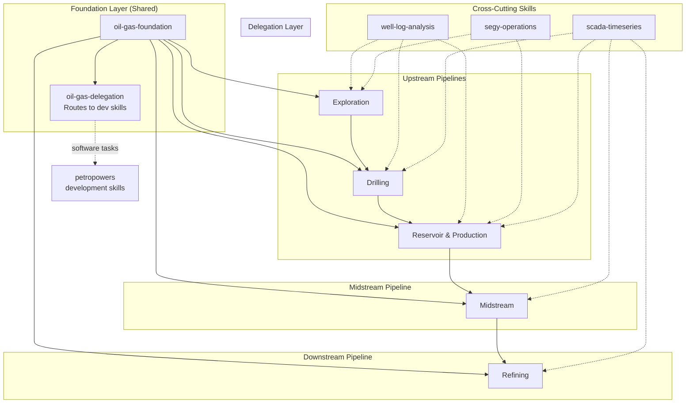
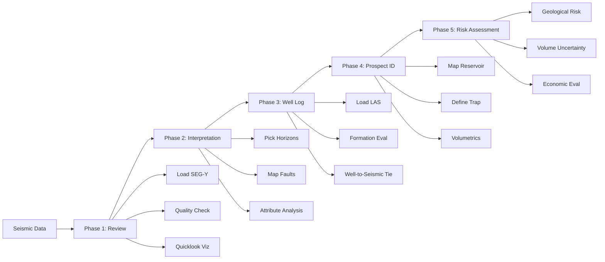
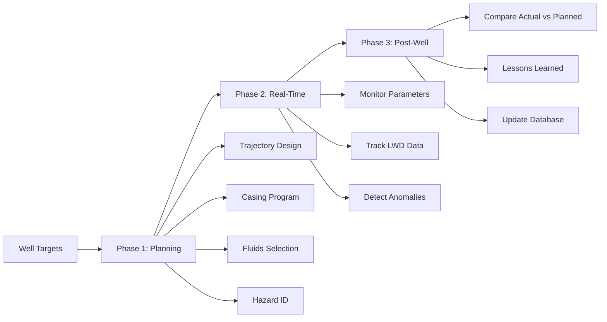
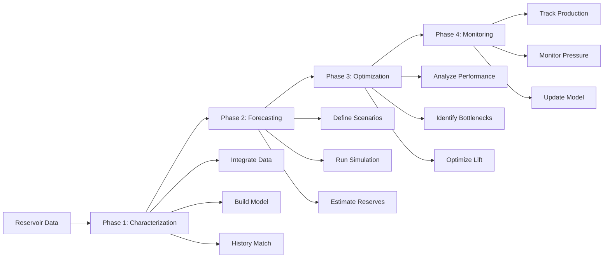
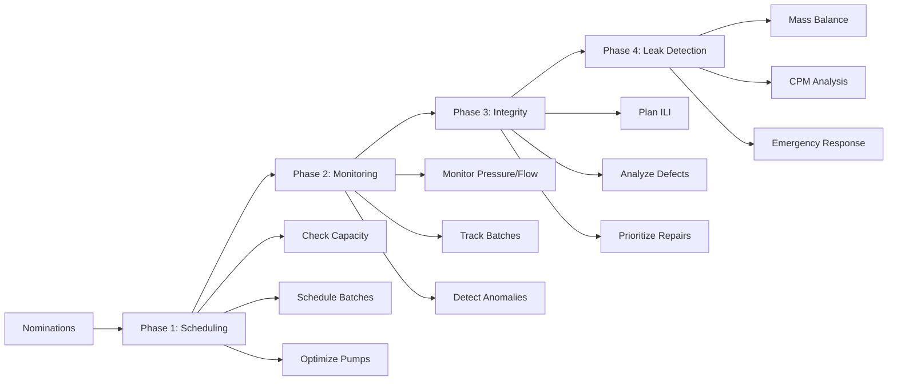
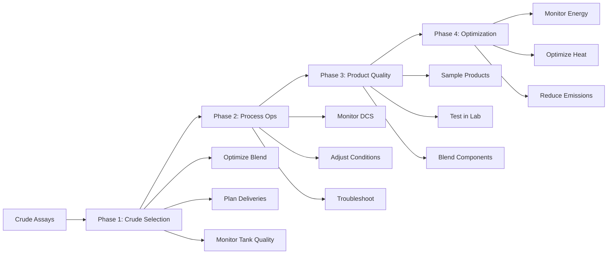
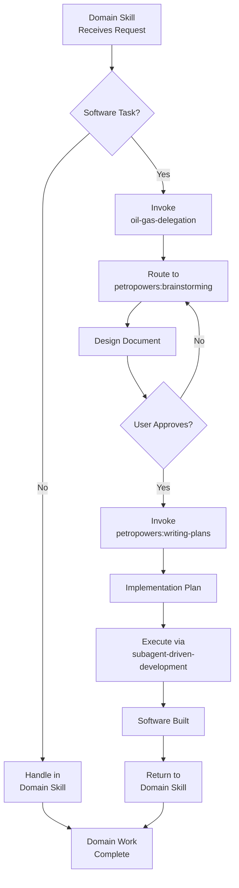
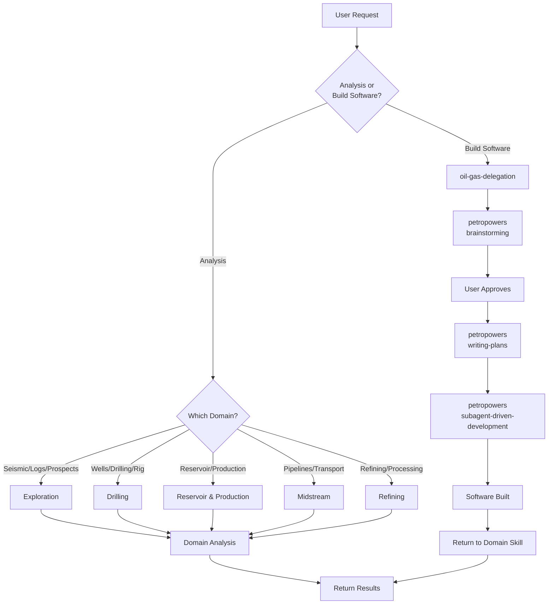
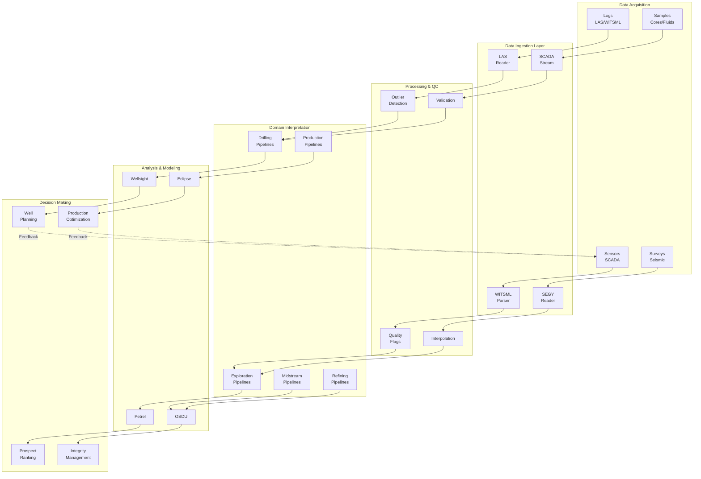

# Oil & Gas Pipeline Documentation

This document provides comprehensive documentation for the oil & gas domain skills in PetroPowers. These skills help AI agents work effectively with petroleum engineering, drilling operations, reservoir management, pipeline operations, and refining processes.

## Introduction

PetroPowers organizes oil & gas skills into two categories:

### Domain Skills
Provide industry-specific knowledge and workflows:
- **Exploration** - Seismic interpretation, well log analysis, prospect evaluation
- **Drilling** - Well planning, real-time monitoring, rig operations
- **Reservoir & Production** - Reservoir modeling, production optimization, decline analysis
- **Midstream** - Pipeline transportation, leak detection, integrity management
- **Refining** - Process operations, crude blending, product quality

Domain skills handle interpretation, analysis, and engineering recommendations using domain expertise.

### Development Skills
Provide software engineering workflows for building tools:
- When domain work requires building software (dashboards, APIs, databases), the delegation skill routes to PetroPowers development skills
- The delegation skill detects software tasks and invokes `brainstorming`, `writing-plans`, and implementation workflows
- After software is built, control returns to domain skill for continued domain work

## Pipeline Architecture

The oil & gas skills are organized as interconnected pipelines sharing common foundation:



**Data Flow:**
1. Exploration identifies prospects → Drilling drills wells → Production extracts hydrocarbons
2. Midstream transports products → Refining processes into final products
3. Cross-cutting skills (well-log, segy, scada) are used across multiple pipelines
4. Delegation skill routes software tasks to appropriate development workflows

## Exploration Pipeline

The exploration pipeline supports geoscientists in discovering hydrocarbon prospects.

### Workflow



### Phases

#### Phase 1: Seismic Data Review
1. Load SEG-Y data
2. Check data quality (signal-to-noise, fold, bin spacing)
3. Generate quicklook visualizations
4. Identify key reflectors

#### Phase 2: Seismic Interpretation
1. Pick horizons (key stratigraphic surfaces)
2. Map faults and structural features
3. Generate attribute volumes (coherence, amplitude, frequency)
4. Identify direct hydrocarbon indicators (DHIs)

#### Phase 3: Well Log Correlation
1. Load well logs (LAS format)
2. Perform formation evaluation
   - Porosity calculation
   - Water saturation
   - Lithology identification
3. Tie wells to seismic (synthetic seismogram)
4. Correlate formations across wells

#### Phase 4: Prospect Identification
1. Integrate seismic and well data
2. Map reservoir extent
3. Define structural/stratigraphic traps
4. Estimate reservoir properties
5. Calculate volumetrics (STOIIP/GIIP)

#### Phase 5: Risk Assessment
1. Geological chance of success (Pg)
   - Trap adequacy
   - Reservoir presence
   - Seal integrity
   - Source maturity
   - Timing/migration
2. Volume uncertainty (P10/P50/P90)
3. Economic evaluation (NPV, IRR)
4. Risk-adjusted prospect ranking

### Data Types

| Data | Format | Skill Reference |
|------|--------|-----------------|
| Seismic volumes | SEG-Y | `oil-gas-cross-cutting/segy-operations` |
| Well logs | LAS | `oil-gas-cross-cutting/well-log-analysis` |
| Geological models | RESQML, proprietary | Custom parsing needed |
| Core samples | Photos, reports | Unstructured analysis |
| Satellite/gravity | GeoTIFF, grids | Geospatial tools |

### Roles

- **Geologist** - Subsurface structure, stratigraphy, depositional systems
- **Geophysicist** - Seismic acquisition, processing, interpretation
- **Petrophysicist** - Well log analysis, formation evaluation
- **Seismic Interpreter** - Horizon picking, fault mapping, attribute analysis

### Example: Volumetrics Calculation

```python
# Simplified STOIIP calculation
area = 500  # acres
thickness = 50  # ft
porosity = 0.20
water_saturation = 0.25
formation_volume_factor = 1.2

# STOIIP = 7758 * A * h * phi * (1-Sw) / Bo
stoiip = 7758 * area * thickness * porosity * (1 - water_saturation) / formation_volume_factor

print(f"STOIIP: {stoiip:,.0f} bbl")
print(f"STOIIP: {stoiip/1e6:.1f} MMbbl")
```

### Quality Checklist

Before finalizing interpretation:

- [ ] Seismic quality reviewed (phase/Amplitude vs Offset, migration)
- [ ] Well ties validated
- [ ] Horizons consistent across dataset
- [ ] Faults mapped with appropriate throw
- [ ] Attribute analysis supports interpretation
- [ ] Volumetrics within credible ranges
- [ ] Risk factors documented

### Safety Considerations

Exploration data informs drilling decisions:

- Inaccurate interpretation can lead to dry holes (financial risk)
- Over-pressured zones must be identified
- Shallow hazards (gas clouds, water flows) must be mapped
- Well planning uses exploration data for casing design

## Drilling Pipeline

The drilling pipeline supports drilling engineers in well planning, real-time monitoring, and post-well analysis.

### Workflow



### Phases

#### Phase 1: Well Planning
1. Define targets (from exploration)
2. Design trajectory (3D wellpath)
3. Design casing program (depths, sizes, grades)
4. Select drilling fluids
5. Identify hazards (pore pressure, fracture gradient, H2S)
6. Optimize drilling parameters (ROP, hydraulics)

#### Phase 2: Real-Time Drilling
1. Monitor drilling parameters
   - Weight on Bit (WOB)
   - RPM (Rotations Per Minute)
   - Torque
   - Rate of Penetration (ROP)
2. Monitor mud returns
   - Flow rate
   - Mud weight
   - Cuttings analysis
3. Monitor LWD data
   - Gamma ray
   - Resistivity
   - Pressure
4. Detect anomalies
   - Kicks (influx of formation fluid)
   - Losses (mud lost to formation)
   - Stuck pipe indicators

#### Phase 3: Post-Well Analysis
1. Compare actual vs. planned
2. Document lessons learned
3. Update drilling database
4. Optimize future wells

### Key Parameters

| Parameter | Typical Range | Alert Threshold |
|-----------|---------------|-----------------|
| WOB | 10-80 klbs | >120% of planned |
| Torque | 5-50 kft-lbs | >110% of planned |
| RPM | 60-180 rpm | Varies |
| ROP | 50-500 ft/hr | Depends on formation |
| Mud weight | 8-20 ppg | >0.5 ppg change |
| Flow in/out | 200-1000 gpm | Not equal = alert |

### Roles

- **Drilling Engineer** - Well design, casing program, drilling parameters
- **Mud Engineer** - Drilling fluids, hydraulics, wellbore stability
- **Well Planner** - Trajectory design, anti-collision, target intercept
- **Rig Supervisor** - Real-time operations, safety, equipment

### Example: Kick Detection

```python
import pandas as pd
import numpy as np

# Simulated real-time data
data = pd.DataFrame({
    'timestamp': pd.date_range('2024-01-01', periods=100, freq='1s'),
    'wob_klbs': np.random.normal(40, 5, 100),
    'torque_kftlbs': np.random.normal(25, 3, 100),
    'rpm': np.random.normal(120, 10, 100),
    'rop_fthr': np.random.normal(150, 30, 100),
    'flow_in_gpm': np.random.normal(800, 20, 100),
    'flow_out_gpm': np.random.normal(800, 20,  100),
})

# Kick detection
def check_for_kick(df):
    alerts = []
    
    # Pit gain (flow out > flow in)
    flow_diff = df['flow_out_gpm'] - df['flow_in_gpm']
    if (flow_diff > 50).any():
        alerts.append('POTENTIAL KICK: Flow out >> Flow in')
    
    # Drilling break
    if df['rop_fthr'].max() > 2 * df['rop_fthr'].median():
        alerts.append('DRILLING BREAK: Check for influx')
    
    return alerts

alerts = check_for_kick(data)
for alert in alerts:
    print(f"ALERT: {alert}")
```

### Safety Focus

**Kick Detection Signs:**
- Mud volume increase (pit gain)
- Flow rate differential (flow in ≠ flow out)
- Mud weight decrease
- Drilling break (sudden ROP increase)

**Response:** STOP, shut-in, record pressures, kill well

**Stuck Pipe Indicators:**
- Excessive torque/drag
- No circulation
- Can't move pipe

**Lost Circulation:**
- Sudden mud loss
- No returns at surface
- Loss > 50 bbl/hr

### Quality Checklist

- [ ] Well control equipment tested
- [ ] Blowout preventer (BOP) function tested
- [ ] Pit volume monitored
- [ ] Flow sensors calibrated
- [ ] LWD tools functional
- [ ] Emergency procedures reviewed

## Reservoir & Production Pipeline

The reservoir & production pipeline supports engineers in managing hydrocarbon extraction and optimizing well performance.

### Workflow



### Phases

#### Phase 1: Reservoir Characterization
1. Integrate seismic, logs, core data
2. Build geological model
3. Upscale to simulation model
4. History match to production data
5. Validate model

#### Phase 2: Production Forecasting
1. Define development scenarios
2. Run reservoir simulation
3. Generate production forecast
4. Estimate reserves (P10/P50/P90)
5. Economic evaluation

#### Phase 3: Well Optimization
1. Analyze well performance (inflow performance, vertical lift)
2. Identify production bottlenecks
3. Optimize artificial lift (gas lift, ESP, rod pump)
4. Plan well interventions
5. Monitor results

#### Phase 4: Reservoir Monitoring
1. Track production vs. forecast
2. Monitor pressure trends
3. Analyze well interference
4. Update model as needed
5. Optimize depletion strategy

### Data Types

| Data | Source | Frequency |
|------|--------|-----------|
| Oil/gas/water rates | SCADA/Metering | Daily/Real-time |
| Pressure (BHP, THP) | Downhole gauges | Real-time |
| Temperature | Downhole gauges | Real-time |
| Reservoir models | Eclipse, CMG, tNavigator | Updated annually |
| Well tests | Separators/MPFM | Monthly |

### Roles

- **Reservoir Engineer** - Reservoir modeling, forecasting, depletion strategy
- **Production Engineer** - Well performance, artificial lift, well intervention
- **Well Intervention Engineer** - Workovers, stimulation, completions

### Example: Decline Curve Analysis

```python
import numpy as np
from scipy.optimize import curve_fit

def arps_decline(t, qi, di, b):
    """Arps decline equation"""
    return qi / (1 + b * di * t)**(1/b)

# Example production data
months = np.arange(1, 61)
actual_rate = 1000 / (1 + 0.1 * months)**(1/0.5)  # D = 0.1, b = 0.5

# Fit decline curve
popt, _ = curve_fit(arps_decline, months, actual_rate, p0=[1000, 0.1, 0.5])

qi, di, b = popt
print(f"Initial rate (qi): {qi:.0f} bpd")
print(f"Initial decline (di): {di:.2f}")
print(f"Arps exponent (b): {b:.2f}")

# Forecast
forecast_months = np.arange(1, 121)
forecast_rate = arps_decline(forecast_months, *popt)

print(f"Forecast at 10 years: {forecast_rate[-1]:.0f} bpd")
```

### Performance Indicators

| KPI | Units | Target |
|-----|-------|--------|
| Uptime | % | >95% |
| Water cut | % | Varies |
| Gas/oil ratio | scf/stb | Varies |
| Drawdown | psi | Optimized |
| Artificial lift efficiency | % | >80% |

### Quality Checklist

- [ ] Production data validated
- [ ] Well tests recent (< 3 months)
- [ ] Pressure data calibrated
- [ ] Reservoir model history matched
- [ ] Forecast assumptions documented

## Midstream Pipeline

The midstream pipeline supports pipeline engineers in ensuring safe and efficient hydrocarbon transportation and storage.

### Workflow



### Phases

#### Phase 1: Transport Scheduling
1. Receive nominations (shipper requests)
2. Check pipeline capacity
3. Schedule batches/products
4. Optimize pump/compressor runs
5. Confirm deliveries

#### Phase 2: Real-Time Monitoring
1. Monitor pressure/flow at key points
2. Track batch locations
3. Detect anomalies (leaks, theft)
4. Adjust operations as needed
5. Communicate with control center

#### Phase 3: Integrity Management
1. Plan ILI (smart pigging)
2. Analyze inspection data
3. Identify defects (corrosion, cracks, dents)
4. Prioritize repairs
5. Verify repairs

#### Phase 4: Leak Detection
1. Monitor CPM (Computational Pipeline Monitoring)
2. Analyze mass balance
3. Check pressure/flow deviations
4. Investigate anomalies
5. Emergency response if confirmed

### Data Types

| Data | Source | Frequency |
|------|--------|-----------|
| Flow rates | SCADA | Real-time (1-min) |
| Pressure | SCADA | Real-time (1-min) |
| Temperature | SCADA | Real-time |
| ILI (Inline Inspection) | Smart pig | 5-year cycle |
| Leak detection | CPM/DDS | Real-time (continuous) |
| Product quality | Lab | Batch/sample |

### Roles

- **Pipeline Engineer** - Pipeline design, hydraulics, materials
- **Operations Manager** - Daily operations, scheduling, nominations
- **Integrity Engineer** - Inspection, corrosion management, repairs

### Example: Leak Detection

```python
def detect_leak(flow_in, flow_out, pressure_in, pressure_out, 
                linepack_initial, linepack_current, tolerance=0.01):
    """
    Simple mass balance leak detection
    
    Returns: (is_leak, discrepancy)
    """
    
    # Mass balance: In - Out = Linepack change + Leak
    # In SCADA units: bpd
    
    # Calculate linepack change
    linepack_change = linepack_current - linepack_initial
    
    # Discrepancy
    discrepancy = flow_in - flow_out - linepack_change
    
    # Threshold (as fraction of flow)
    threshold = flow_in * tolerance
    
    is_leak = abs(discrepancy) > threshold
    
    return is_leak, discrepancy

# Example
flow_in = 50000  # bpd
flow_out = 49500  # bpd
linepack_initial = 10000  # bbl
linepack_current = 10050  # bbl

is_leak, discrepancy = detect_leak(flow_in, flow_out, 0, 0, 
                                    linepack_initial, linepack_current)

if is_leak:
    print(f"LEAK DETECTED: {discrepancy:.0f} bpd discrepancy")
else:
    print(f"Normal operation: {discrepancy:.0f} bpd discrepancy")
```

### Performance Indicators

| KPI | Units | Target |
|-----|-------|--------|
| Availability | % | >99% |
| Leak incidents | per 1000 km-yr | <0.5 |
| ILI compliance | % | 100% |
| On-time delivery | % | >98% |
| Energy efficiency | kWh/bbl | Minimize |

### Safety Considerations

Pipeline safety critical areas:
- High consequence areas (populated, environmentally sensitive)
- Leak detection coverage must be continuous
- Emergency shutdown systems tested regularly
- Public awareness programs maintained
- One-call system for excavation permits

### Quality Checklist

- [ ] Leak detection system operational
- [ ] Pressure/flow instruments calibrated
- [ ] ILI inspections current (< 5 years)
- [ ] Emergency response plan updated
- [ ] Control room procedures reviewed

## Refining Pipeline

The refining pipeline supports process and chemical engineers in refinery operations, optimization, and product quality control.

### Workflow



### Phases

#### Phase 1: Crude Selection & Blending
1. Receive crude assays (composition, properties)
2. Optimize crude blend for:
   - Target product slate
   - Unit constraints
   - Margin maximization
3. Plan crude deliveries
4. Monitor crude tank quality

#### Phase 2: Process Operations
1. Monitor unit operations (DCS)
2. Optimize cut points (distillation)
3. Adjust operating conditions
4. Monitor yields and quality
5. Troubleshoot upsets

#### Phase 3: Product Quality
1. Sample products (gasoline, diesel, jet, fuel oil)
2. Test in lab (ASTM methods)
3. Blend components to meet specs
4. Certify products for release
5. Track product inventory

#### Phase 4: Energy & Yield Optimization
1. Monitor energy consumption
2. Optimize heat integration
3. Maximize yield of high-value products
4. Minimize fuel gas, steam consumption
5. Reduce CO2 emissions

### Data Types

| Data | Source | Frequency |
|------|--------|-----------|
| Crude assay | Lab/Supplier | Batch |
| Temperature/pressure | DCS | Real-time (1-sec) |
| Flow rates | DCS | Real-time (1-sec) |
| Product qualities | Lab | 4-8 hours |
| Catalyst activity | Lab | Weekly |
| Energy consumption | Meters | Hourly |

### Roles

- **Process Engineer** - Unit operations, optimization, troubleshooting
- **Chemical Engineer** - Reaction engineering, catalysts, chemistry
- **Plant Operator** - Daily operations, monitoring, adjustments
- **Lab Technician** - Product quality testing, sampling

### Example: Product Blending

```python
def blend_gasoline(components, target_ron, target_rvp):
    """
    Simple gasoline blending for RON (Octane) and RVP (Vapor Pressure)
    
    components: [{'name': str, 'vol': bbl, 'ron': float, 'rvp': float}, ...]
    """
    
    total_vol = sum(c['vol'] for c in components)
    
    # Weighted average blending (simplified)
    blended_ron = sum(c['vol'] * c['ron'] for c in components) / total_vol
    blended_rvp = sum(c['vol'] * c['rvp'] for c in components) / total_vol
    
    # Check specs
    meets_ron = blended_ron >= target_ron
    meets_rvp = blended_rvp <= target_rvp
    
    return {
        'ron': blended_ron,
        'rvp': blended_rvp,
        'volume': total_vol,
        'meets_specs': meets_ron and meets_rvp,
        'ron_ok': meets_ron,
        'rvp_ok': meets_rvp,
    }

# Example
components = [
    {'name': 'FCC Gasoline', 'vol': 20000, 'ron': 92, 'rvp': 8.0},
    {'name': 'Reformate', 'vol': 15000, 'ron': 100, 'rvp': 4.5},
    {'name': 'Alkylate', 'vol': 8000, 'ron': 95, 'rvp': 5.0},
    {'name': 'Butane', 'vol': 2000, 'ron': 93, 'rvp': 60.0},
]

result = blend_gasoline(components, target_ron=87, target_rvp=9.0)
print(f"Blended: RON={result['ron']:.1f}, RVP={result['rvp']:.1f} psi")
print(f"Meets specs: {result['meets_specs']}")
```

### Key Products

| Product | Key Specs | Typical Yield |
|---------|-----------|---------------|
| Gasoline | RON, RVP, Sulfur | 40-50% |
| Diesel | Cetane, Sulfur, Flash | 25-35% |
| Jet Fuel | Flash, Freeze, Smoke | 5-10% |
| Fuel Oil | Viscosity, Sulfur | 5-15% |
| LPG | Composition | 2-5% |

### Performance Indicators

| KPI | Units | Target |
|-----|-------|--------|
| Utilization | % | >95% |
| Energy intensity | MMBTU/bbl | <0.4 |
| On-spec products | % | >99% |
| Yield (high-value) | % | Maximize |
| Safety (TRIR) | per 200k hrs | <0.5 |

### Safety Considerations

Refinery hazards:
- Fire/explosion (hydrocarbons under pressure)
- Toxic releases (H2S, ammonia, HF)
- Runaway reactions (alkylation, hydrocracking)
- Loss of containment

Critical safety systems:
- Relief valves and flare systems
- Fire detection and suppression
- Gas detection (H2S, LEL)
- Emergency shutdown (ESD)

### Quality Checklist

- [ ] Product samples drawn and tested
- [ ] DCS alarms active and acknowledged
- [ ] Safety systems tested (monthly)
- [ ] Turnaround plans updated
- [ ] Environmental permits current

## Cross-Cutting Skills

These skills provide specialized data handling capabilities used across multiple pipelines.

### Well Log Analysis (LAS)

**Purpose:** Read, analyze, and manipulate well log data in LAS format using lasio library.

**Used by:**
- Exploration - Formation evaluation, log correlation
- Drilling - Real-time LWD interpretation
- Reservoir & Production - Reservoir characterization

**Key Capabilities:**
- Read LAS files and convert to DataFrames
- Calculate porosity from density logs
- Calculate water saturation (Archie equation)
- Calculate shale volume from gamma ray
- Visualize well logs
- Export to CSV/Excel/LAS
- OSDU integration (WellLog schema)

**Example:**
```python
import lasio
import numpy as np

log = lasio.read('well.las')
df = log.df()

# Porosity from density
matrix = 2.65  # g/cc (sandstone)
fluid = 1.0    # g/cc (water)
phi = (matrix - df['RHOB']) / (matrix - fluid)

print(f"Average porosity: {phi.mean():.2%}")
```

**Software Tasks:**
- Well log database → invoke `oil-gas-delegation`
- Log visualization web app → invoke `oil-gas-delegation`

### SEG-Y Operations

**Purpose:** Read, manipulate, and write SEG-Y seismic data using segyio library.

**Used by:**
- Exploration - Seismic interpretation
- Reservoir & Production - Horizon picking, attribute analysis

**Key Capabilities:**
- Open SEG-Y files and read as 3D cubes
- Extract headers to DataFrame
- Access inline/crossline/time slices
- Visualize seismic data
- Write modified SEG-Y files
- Create fault volumes
- OSDU integration (VDS/ZGY conversion)

**Example:**
```python
import segyio
import numpy as np

with segyio.open('seismic.sgy', 'r') as segyfile:
    data = segyio.tools.cube(segyfile)
    print(f"Shape: {data.shape}")
    print(f"Amplitude range: {data.min():.0f} to {data.max():.0f}")
```

**Software Tasks:**
- Seismic visualization web app → invoke `oil-gas-delegation`
- SEG-Y database system → invoke `oil-gas-delegation`

### SCADA & Time-Series

**Purpose:** Handle real-time SCADA data, WITSML/PRODML streams, and time-series analysis.

**Used by:**
- Drilling - Real-time drilling monitoring
- Reservoir & Production - Production optimization
- Midstream - Pipeline leak detection
- Refining - Process monitoring

**Key Capabilities:**
- Parse WITSML/PRODML data
- Real-time monitoring with threshold alerts
- Anomaly detection (Z-score, IQR methods)
- Quality flag assignment
- Resampling and aggregation
- Trend analysis
- OSDU integration (Activity, WellLog schemas)

**Example:**
```python
import pandas as pd
from scipy import stats
import numpy as np

# Anomaly detection using Z-score
def detect_anomalies_zscore(data, threshold=3):
    z_scores = np.abs(stats.zscore(data))
    anomalies = z_scores > threshold
    return anomalies

pressure = data['pressure_psi'].values
anomalies = detect_anomalies_zscore(pressure)
print(f"Anomalies detected: {anomalies.sum()}")
```

**Software Tasks:**
- Real-time monitoring dashboard → invoke `oil-gas-delegation`
- Anomaly detection system → invoke `oil-gas-delegation`

## Foundation & Delegation

### Foundation Skill (oil-gas-foundation)

The foundation skill provides core industry knowledge shared across all pipeline skills:

**Industry Overview:**
- **Upstream (E&P)** - Exploration, appraisal, drilling, production
- **Midstream** - Transportation and storage
- **Downstream** - Refining and distribution

**Role Hierarchy:**
```
Executives
  ↓
Asset / Field Managers
  ↓
Domain Leads (Geology, Drilling, Production, Facilities)
  ↓
Engineers & Scientists
  ↓
Operators / Technicians
  ↓
Data & Digital (cross-cutting)
```

**Data Flow:**
```
Raw Data Acquisition
  ↓
Data Ingestion (WITSML, LAS, SCADA, etc.)
  ↓
Data Processing & QC
  ↓
Domain Interpretation (Geology, Drilling, etc.)
  ↓
Modeling & Simulation
  ↓
Decision Making
  ↓
Execution (Drill / Produce / Transport)
  ↓
Feedback Loop (real-time data)
```

**Common Data Formats:**

| Format | Purpose | File Extension |
|--------|---------|----------------|
| LAS | Well log data | .las |
| SEG-Y | Seismic data | .sgy, .segy |
| WITSML | Drilling/completion data | XML |
| PRODML | Production data | XML |
| RESQML | Reservoir models | XML/EPC |
| DLIS | Well log data (binary) | .dlis |

**Safety Culture:**
- HSE (Health, Safety, Environment) is non-negotiable
- "Stop work authority" - anyone can halt unsafe operations
- Risk assessments (JSA, HAZOP, HAZID) before operations
- Regulatory compliance: EPA, OSHA, BSEE (US), NPD (Norway), etc.

**Key Safety Concepts:**
- **Well control** - Preventing uncontrolled hydrocarbon release
- **Process safety** - Managing hazardous materials and pressures
- **Asset integrity** - Ensuring equipment fitness-for-service
- **Environmental protection** - Spill prevention, emissions control

### Delegation Skill (oil-gas-delegation)

The delegation skill is a meta-skill that routes software development tasks to appropriate PetroPowers workflows:

**Purpose:**
Oil & gas domain skills handle interpretation, analysis, and optimization recommendations. When a request requires building software (web apps, dashboards, APIs, databases), this skill delegates to PetroPowers development skills.

**Detection Logic:**
When a request contains any of these keywords, delegate to software development workflow:
- Web app, dashboard, visualization
- API, REST endpoint, GraphQL
- Database schema, data model, persistence
- Data pipeline, ETL, automation script
- Report generation system
- Alert notification system

**Decision Flow:**
```
User request received
  ↓
Does request require building software?
  ↓
  YES → Invoke oil-gas-delegation
        ↓
        Route to appropriate petropowers workflow:
        - brainstorming (design)
        - writing-plans (implementation plan)
        - subagent-driven-development (execution)
  ↓
  NO → Handle within domain skill
```

**Delegation Workflow:**



**Domain-Only Tasks (No Delegation):**
- "Analyze this seismic section for faults"
- "Interpret well log data for porosity"
- "Calculate probability of success for this prospect"
- "Optimize drilling parameters"
- "Forecast production decline"
- "Assess pipeline integrity"

Domain skills provide analysis, recommendations, and domain expertise. Software skills build tools to support that work.

**Software Tasks (Requires Delegation):**
- "Build a drilling monitoring dashboard"
- "Create an automated LAS file processor"
- "Build a REST API for production data"
- "Write a script to convert SEG-Y to numpy"

**Example Interaction:**

**User:** "I need a dashboard to visualize my seismic data"

**Agent response:**
1. Recognize: "dashboard" → software task
2. Invoke: `petropowers:oil-gas-delegation`
3. Delegation skill:
   - Invokes `petropowers:brainstorming` for dashboard design
   - Design: "Seismic Visualization Dashboard"
     - Upload SEG-Y files
     - Display inline/crossline/time slices
     - Filter by amplitude range
   - User approves design
   - Invokes `petropowers:writing-plans` for implementation plan
   - Executes via TDD workflow

**User:** "What's the porosity in this well based on the logs?"

**Agent response:**
1. Recognize: Domain analysis, no software
2. Invoke: `petropowers:oil-gas-pipelines/exploration`
3. Domain skill:
   - Reads LAS file
   - Calculates porosity from density/neutron logs
   - Returns analysis result

## Workflow Integration

### Decision Tree: Domain vs Software Tasks



### Example Scenarios

#### Scenario 1: Seismic Interpretation (Domain Task)

**User:** "What's the amplitude range in this SEG-Y file?"

**Agent:**
1. Recognize: Domain analysis task
2. Invoke: `oil-gas-pipelines/exploration`
3. Use: `oil-gas-cross-cutting/segy-operations` for code pattern
4. Execute: Python code to analyze SEG-Y
5. Return: "Amplitude range: -32768 to 32767"

**No delegation needed.**

#### Scenario 2: Seismic Dashboard (Software Task)

**User:** "Build a seismic visualization dashboard"

**Agent:**
1. Recognize: Software task ("dashboard")
2. Invoke: `oil-gas-delegation`
3. Delegation skill routes to:
   - `petropowers:brainstorming` → Design dashboard
   - User approval
   - `petropowers:writing-plans` → Implementation plan
   - `petropowers:subagent-driven-development` → Execute
4. Return: Dashboard application

#### Scenario 3: Porosity Calculation with Follow-up

**User:** "Calculate porosity from this LAS file, then create a web app to view it"

**Agent:**
1. Invoke: `oil-gas-pipelines/exploration`
2. Use: `oil-gas-cross-cutting/well-log-analysis`
3. Execute: Python code to calculate porosity
4. Return results
5. Recognize: "web app" → software task
6. Invoke: `oil-gas-delegation`
7. Delegation routes to development workflow
8. Build web app
9. Return complete solution

## Data Flow

### Data Formats Table

| Format | Purpose | Typical Use | File Extension |
|--------|---------|-------------|----------------|
| LAS | Well log data | Formation evaluation, petrophysics | .las |
| SEG-Y | Seismic data | Exploration, reservoir characterization | .sgy, .segy |
| WITSML | Drilling data | Real-time drilling monitoring | XML |
| PRODML | Production data | Production optimization | XML |
| RESQML | Reservoir models | Simulation, reserves estimation | XML/EPC |
| DLIS | Well logs (binary) | High-density logging data | .dlis |
| SCADA | Real-time sensor data | Operations monitoring | Various |

### Format Descriptions

#### LAS (Log ASCII Standard)
- Text-based well log format
- Human-readable
- Contains header metadata + curve data
- Widely supported bylog analysis software
- Standard: CWLS LAS 3.0

#### SEG-Y
- Binary seismic data format
- Standard for seismic exchange
- Contains trace data + headers
- Trace headers include position info
- Standard: SEG-Y Revision 2.0

#### WITSML
- XML-based drilling data standard
- Real-time and historical data
- Wells, wellbores, logs, trajectories
- Managed by Energistics consortium
- Standard: WITSML 1.4.1 / 2.0

#### PRODML
- XML-based production data standard
- Production rates, well tests
- Allocations, fluid analyses
- Managed by Energistics consortium
- Standard: PRODML 2.2

#### RESQML
- XML-based reservoir model standard
- Geological models, grids, surfaces
- Integration between software
- Uses EPC (Energistics Packaging)
- Standard: RESQML 2.0

### Data Flow Architecture



**Data Flow Steps:**
1. **Acquisition** - Sensors, surveys, logs capture raw data
2. **Ingestion** - Domain-specific parsers read formats (WITSML, LAS, SEG-Y, SCADA)
3. **Processing** - Quality checks, outlier detection, interpolation
4. **Interpretation** - Domain skills apply expertise
5. **Analysis** - Software tools (Petrel, Eclipse, OSDU) support analysis
6. **Decision** - Engineers and managers make decisions
7. **Feedback** - Operations generate new data, closing the loop

## References

### Skill Files

**Foundation & Delegation:**
- [oil-gas-foundation/SKILL.md](../skills/oil-gas-foundation/SKILL.md) - Core industry knowledge
- [oil-gas-delegation/SKILL.md](../skills/oil-gas-delegation/SKILL.md) - Routes to development skills

**Pipeline Skills:**
- [oil-gas-pipelines/exploration/SKILL.md](../skills/oil-gas-pipelines/exploration/SKILL.md) - Exploration workflow
- [oil-gas-pipelines/drilling/SKILL.md](../skills/oil-gas-pipelines/drilling/SKILL.md) - Drilling operations
- [oil-gas-pipelines/reservoir-production/SKILL.md](../skills/oil-gas-pipelines/reservoir-production/SKILL.md) - Reservoir management
- [oil-gas-pipelines/midstream/SKILL.md](../skills/oil-gas-pipelines/midstream/SKILL.md) - Pipeline operations
- [oil-gas-pipelines/refining/SKILL.md](../skills/oil-gas-pipelines/refining/SKILL.md) - Refinery operations

**Cross-Cutting Skills:**
- [oil-gas-cross-cutting/well-log-analysis/SKILL.md](../skills/oil-gas-cross-cutting/well-log-analysis/SKILL.md) - LAS file operations
- [oil-gas-cross-cutting/segy-operations/SKILL.md](../skills/oil-gas-cross-cutting/segy-operations/SKILL.md) - SEG-Y operations
- [oil-gas-cross-cutting/scada-timeseries/SKILL.md](../skills/oil-gas-cross-cutting/scada-timeseries/SKILL.md) - SCADA data handling

### Industry Standards

- **SEG-Y** - Society of Exploration Geophysicists, Seismic Data Format
- **LAS** - Canadian Well Logging Society, Log ASCII Standard
- **WITSML** - Energistics, Wellsite Information Transfer Standard
- **PRODML** - Energistics, Production Markup Language
- **RESQML** - Energistics, Reservoir Characterization Markup Language
- **OSDU** - Open Subsurface Data Universe

### Key References

- **Exploration**: SEG-Y format, LAS specifications, Chopra & Marfurt (2007), Rose (2001)
- **Drilling**: SPE Drilling & Completion, API SPEC 5CT, IADC Drilling Manual
- **Reservoir**: Craft & Hawkins (1991), Arps (1945), Vogel (1968)
- **Midstream**: ASME B31.4, ASME B31.8, API 1160, PHMSA regulations
- **Refining**: Gary & Handwerk (2001), ASTM Standards, API Recommended Practices