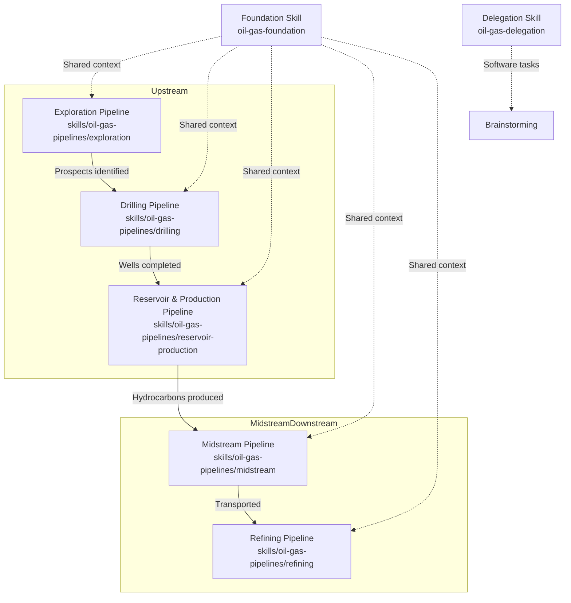
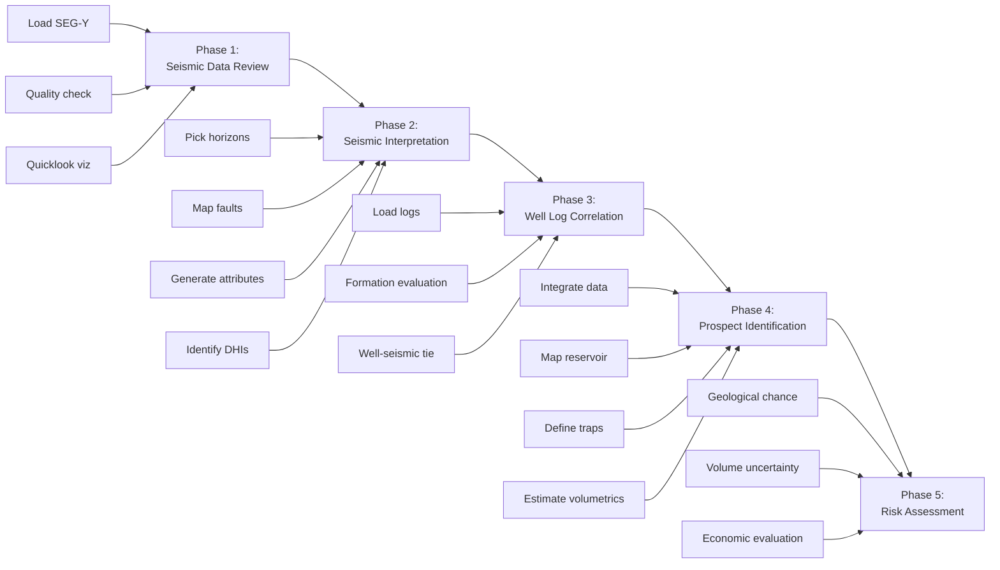
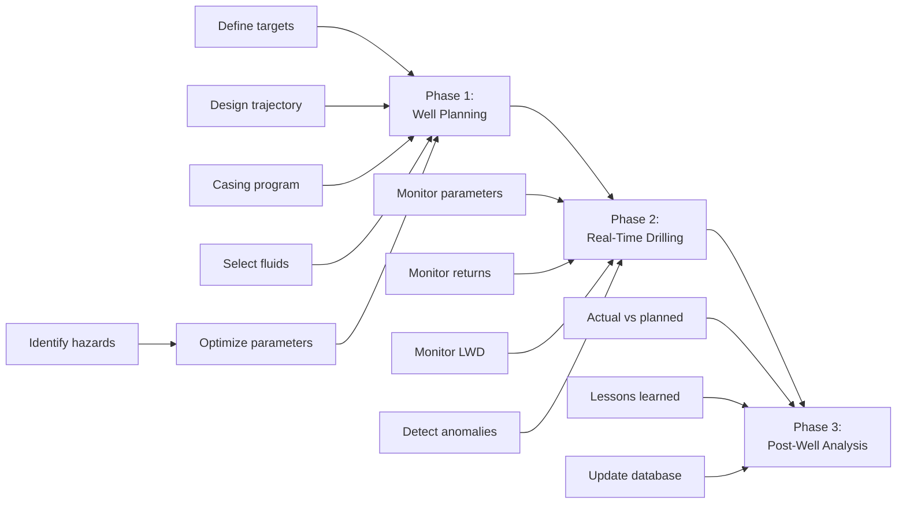
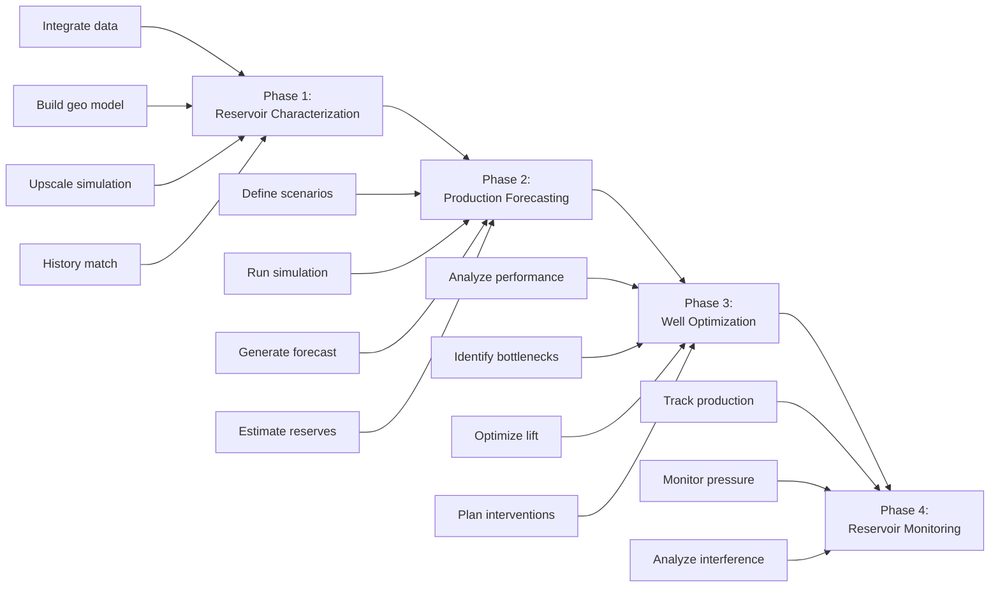
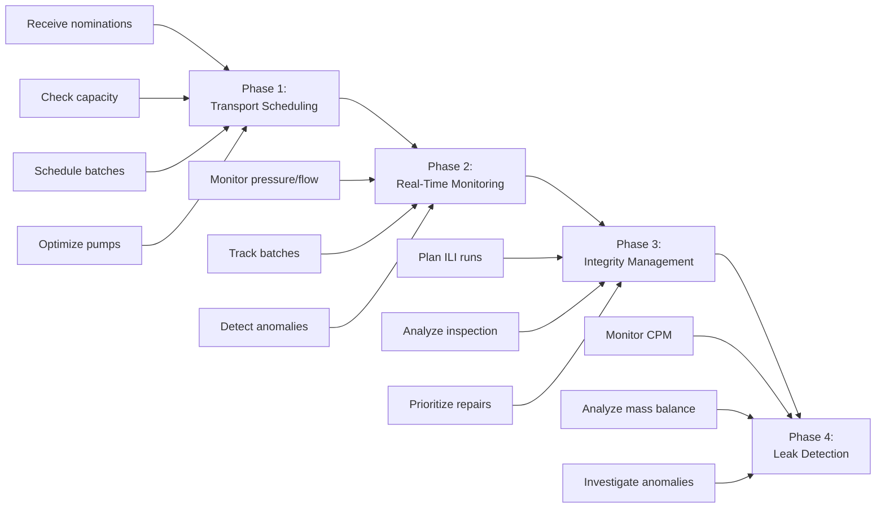
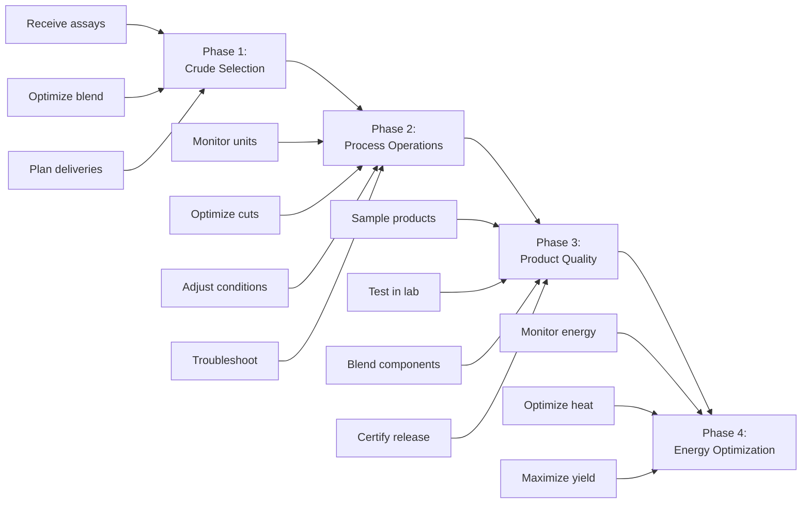
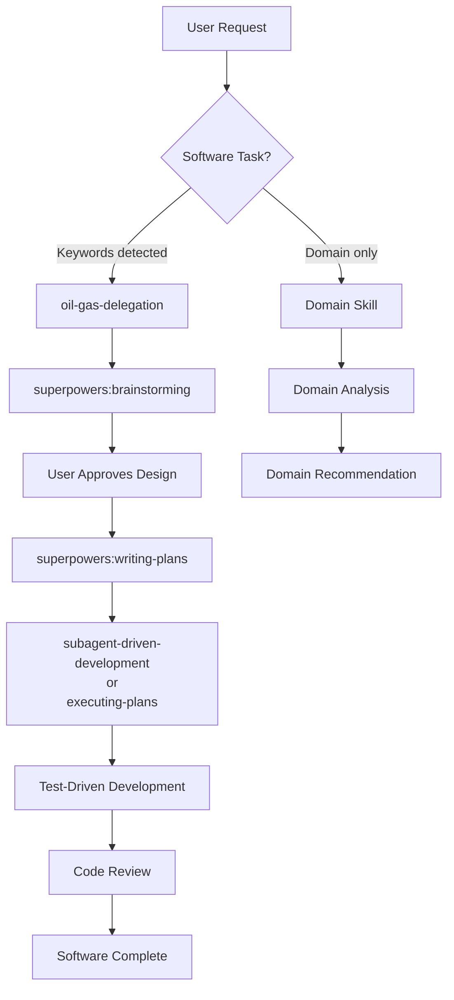
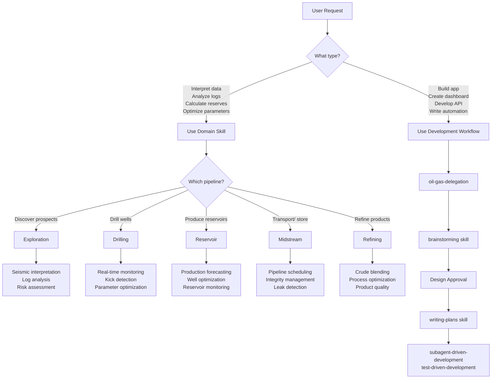
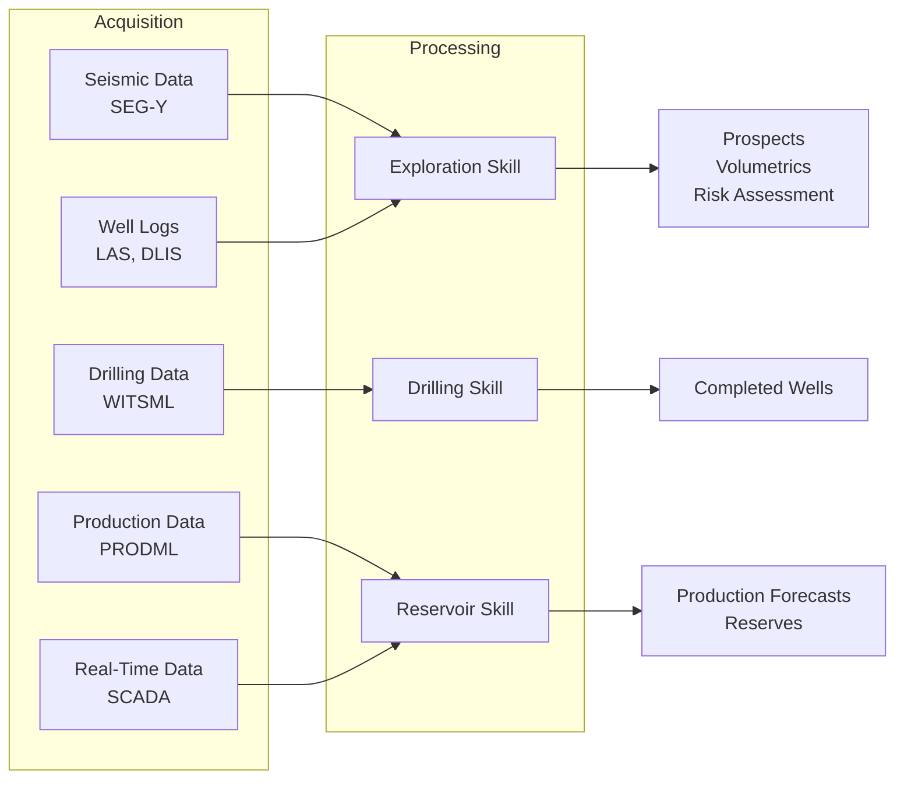
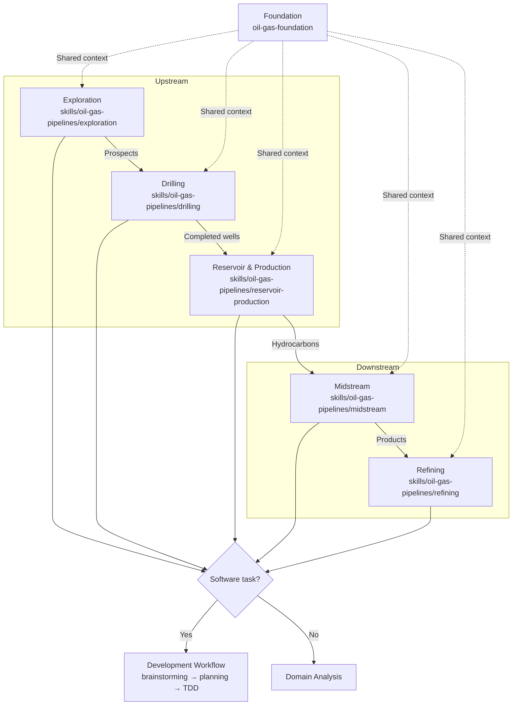

# Pipeline Documentation Implementation Plan

> **For agentic workers:** REQUIRED SUB-SKILL: Use superpowers:subagent-driven-development (recommended) or superpowers:executing-plans to implement this plan task-by-task. Steps use checkbox (`- [ ]`) syntax for tracking.

**Goal:** Add comprehensive pipeline documentation showing oil & gas domain skills and their integration with development workflows.

**Architecture:** Layered documentation approach - README.md gets high-level overview with master diagram for all audiences, docs/oil-gas-pipelines.md gets detailed technical documentation for developers.

**Tech Stack:** Markdown with Mermaid diagrams

---

## Task 1: Create detailed pipeline documentation file

**Files:**
- Create: `docs/oil-gas-pipelines.md`
- Reference: `skills/oil-gas-foundation/SKILL.md`
- Reference: `skills/oil-gas-delegation/SKILL.md`
- Reference: `skills/oil-gas-pipelines/exploration/SKILL.md`
- Reference: `skills/oil-gas-pipelines/drilling/SKILL.md`
- Reference: `skills/oil-gas-pipelines/reservoir-production/SKILL.md`
- Reference: `skills/oil-gas-pipelines/midstream/SKILL.md`
- Reference: `skills/oil-gas-pipelines/refining/SKILL.md`

- [ ] **Step 1: Create markdown file with introduction section**

Create `docs/oil-gas-pipelines.md`:

```markdown
# Oil & Gas Domain Pipelines

Comprehensive documentation of oil & gas domain skills in the Superpowers framework.

## Introduction

Superpowers includes two types of skills:

1. **Development workflow skills** - Guide software development through brainstorming, planning, TDD, and review
2. **Domain skills** - Provide industry-specific expertise for oil & gas operations

Oil & gas domain skills handle interpretation, analysis, and optimization recommendations. When a request requires building software (dashboards, APIs, data pipelines), the framework delegates to development workflow skills.

### Purpose

These skills help AI agents:

- Understand oil & gas terminology and workflows
- Work with industry data formats (LAS, SEG-Y, WITSML, etc.)
- Follow domain-specific best practices
- Apply appropriate safety considerations
- Know when to delegate to software development workflows

### Integration with Development Workflows

Domain skills focus on domain expertise. Software development tasks are delegated:

```
User: "Analyze porosity from this well log"
  → Domain skill handles interpretation
  
User: "Build a dashboard to display well logs"
  → Domain skill delegates to brainstorming
  → TDD workflow builds software
```

This separation ensures domain work uses domain expertise, while software work follows engineering best practices.
```

- [ ] **Step 2: Add pipeline architecture section with master diagram**

Append to `docs/oil-gas-pipelines.md`:

```markdown

## Pipeline Architecture

Oil & gas operations flow through distinct lifecycle stages, each covered by dedicated skills:



### Pipeline Relationships

**Upstream lifecycle:**
1. **Exploration** - Discover hydrocarbon prospects through seismic interpretation, well log analysis, and risk assessment
2. **Drilling** - Execute well construction with real-time monitoring and safety protocols
3. **Reservoir & Production** - Manage extraction and optimize well performance through the production lifecycle

**Downstream operations:**
4. **Midstream** - Transport and store hydrocarbons safely via pipelines and facilities
5. **Refining** - Process crude oil into marketable products through distillation and treatment

**Cross-cutting skills** support multiple pipelines:
- Well log analysis (exploration, drilling, reservoir)
- SEG-Y operations (exploration)
- SCADA time-series (drilling, reservoir, midstream, refining)

**Foundation skill** provides shared context for all domain skills:
- Industry terminology
- Role hierarchy
- Data format reference
- Safety culture
```

- [ ] **Step 3: Add exploration pipeline detailed documentation**

Append to `docs/oil-gas-pipelines.md`:

```markdown

## Pipeline Details

### Exploration Pipeline

**Skill:** `skills/oil-gas-pipelines/exploration/SKILL.md`

**Purpose:** Support geoscientists in discovering hydrocarbon prospects through seismic interpretation, well log analysis, and risk assessment.

**Roles:** Geologist, Geophysicist, Petrophysicist, Seismic Interpreter

**Workflow:**



**Phase Details:**

**Phase 1: Seismic Data Review**
- Load SEG-Y seismic volumes
- Check data quality (signal-to-noise, fold, bin spacing)
- Generate quicklook visualizations
- Identify key reflectors

**Phase 2: Seismic Interpretation**
- Pick horizons (key stratigraphic surfaces)
- Map faults and structural features
- Generate attribute volumes (coherence, amplitude, frequency)
- Identify direct hydrocarbon indicators (DHIs)

**Phase 3: Well Log Correlation**
- Load well logs (LAS format)
- Perform formation evaluation (porosity, saturation, lithology)
- Tie wells to seismic (synthetic seismogram)
- Correlate formations across wells

**Phase 4: Prospect Identification**
- Integrate seismic and well data
- Map reservoir extent
- Define structural/stratigraphic traps
- Estimate reservoir properties
- Calculate volumetrics (STOIIP/GIIP)

**Phase 5: Risk Assessment**
- Geological chance of success (Pg)
  - Trap adequacy
  - Reservoir presence
  - Seal integrity
  - Source maturity
  - Timing/migration
- Volume uncertainty (P10/P50/P90)
- Economic evaluation (NPV, IRR)
- Risk-adjusted prospect ranking

**Data Formats:**
- SEG-Y (seismic volumes)
- LAS (well logs)
- RESQML (reservoir models)

**Software Task Triggers:**
- Seismic visualization web application
- Prospect database system
- Automated report generation
- Real-time drilling dashboard
```

- [ ] **Step 4: Add drilling pipeline detailed documentation**

Append to `docs/oil-gas-pipelines.md`:

```markdown

### Drilling Pipeline

**Skill:** `skills/oil-gas-pipelines/drilling/SKILL.md`

**Purpose:** Support drilling engineers in well planning, real-time monitoring, and post-well analysis.

**Roles:** Drilling Engineer, Mud Engineer, Well Planner, Rig Supervisor

**Workflow:**



**Phase Details:**

**Phase 1: Well Planning**
- Define targets (from exploration results)
- Design trajectory (3D wellpath)
- Design casing program (depths, sizes, grades)
- Select drilling fluids
- Identify hazards (pore pressure, fracture gradient, H2S)
- Optimize drilling parameters (ROP, hydraulics)

**Phase 2: Real-Time Drilling**
- Monitor drilling parameters (WOB, RPM, Torque, ROP)
- Monitor mud returns (flow rate, weight, cuttings)
- Monitor LWD data (gamma ray, resistivity, pressure)
- Detect anomalies
  - Kicks (influx of formation fluid)
  - Losses (mud lost to formation)
  - Stuck pipe indicators

**Phase 3: Post-Well Analysis**
- Compare actual vs. planned
- Document lessons learned
- Update drilling database
- Optimize future wells

**Key Parameters:**

| Parameter | Typical Range | Alert Threshold |
|-----------|---------------|-----------------|
| WOB | 10-80 klbs | >120% of planned |
| Torque | 5-50 kft-lbs | >110% of planned |
| RPM | 60-180 rpm | Varies |
| ROP | 50-500 ft/hr | Depends on formation |
| Mud weight | 8-20 ppg | >0.5 ppg change |

**Data Formats:**
- WITSML (drilling/completion data)
- Real-time streaming (1 Hz sensors)

**Safety Considerations:**
- Well control is critical
- Kick detection priority
- Stuck pipe prevention
- Real-time decision making

**Software Task Triggers:**
- Real-time drilling dashboard
- Automated kick detection alerts
- Drilling parameter optimization tool
```

- [ ] **Step 5: Add reservoir and production pipeline detailed documentation**

Append to `docs/oil-gas-pipelines.md`:

```markdown

### Reservoir & Production Pipeline

**Skill:** `skills/oil-gas-pipelines/reservoir-production/SKILL.md`

**Purpose:** Support reservoir and production engineers in managing hydrocarbon extraction and optimizing well performance.

**Roles:** Reservoir Engineer, Production Engineer, Well Intervention Engineer

**Workflow:**



**Phase Details:**

**Phase 1: Reservoir Characterization**
- Integrate seismic, logs, core data
- Build geological model
- Upscale to simulation model
- History match to production data
- Validate model

**Phase 2: Production Forecasting**
- Define development scenarios
- Run reservoir simulation
- Generate production forecast
- Estimate reserves (P10/P50/P90)
- Economic evaluation

**Phase 3: Well Optimization**
- Analyze well performance (IPR, VLP)
- Identify production bottlenecks
- Optimize artificial lift (gas lift, ESP, rod pump)
- Plan well interventions
- Monitor results

**Phase 4: Reservoir Monitoring**
- Track production vs. forecast
- Monitor pressure trends
- Analyze well interference
- Update model as needed
- Optimize depletion strategy

**Key Analyses:**
- Decline curve analysis
- Inflow performance relationship (IPR)
- Nodal analysis
- Material balance
- Reserves estimation

**Data Formats:**
- PRODML (production data)
- RESQML (reservoir models)
- Real-time sensor data (downhole gauges)

**Software Task Triggers:**
- Production allocation system
- Reservoir monitoring dashboard
- Automated well testing workflow
```

- [ ] **Step 6: Add midstream pipeline detailed documentation**

Append to `docs/oil-gas-pipelines.md`:

```markdown

### Midstream Pipeline

**Skill:** `skills/oil-gas-pipelines/midstream/SKILL.md`

**Purpose:** Support pipeline engineers in ensuring safe and efficient hydrocarbon transportation and storage.

**Roles:** Pipeline Engineer, Operations Manager, Integrity Engineer

**Workflow:**



**Phase Details:**

**Phase 1: Transport Scheduling**
- Receive nominations (shipper requests)
- Check pipeline capacity
- Schedule batches/products
- Optimize pump/compressor runs
- Confirm deliveries

**Phase 2: Real-Time Monitoring**
- Monitor pressure/flow at key points
- Track batch locations
- Detect anomalies (leaks, theft)
- Adjust operations as needed

**Phase 3: Integrity Management**
- Plan ILI (smart pigging)
- Analyze inspection data
- Identify defects (corrosion, cracks, dents)
- Prioritize repairs
- Verify repairs

**Phase 4: Leak Detection**
- Monitor CPM (Computational Pipeline Monitoring)
- Analyze mass balance
- Check pressure/flow deviations
- Investigate anomalies
- Emergency response if confirmed

**Key Analyses:**
- Pipeline hydraulics calculation
- Leak detection analysis
- ILI data interpretation
- Integrity assessment

**Data Formats:**
- SCADA (real-time monitoring, 1-min frequency)
- ILI reports (5-year cycle)
- Leak detection systems (continuous)

**Safety Considerations:**
- Leak detection is critical
- Regular integrity assessments
- Emergency response planning
- Regulatory compliance (PHMSA, etc.)

**Software Task Triggers:**
- SCADA monitoring dashboard
- Pipeline scheduling system
- ILI data management platform
```

- [ ] **Step 7: Add refining pipeline detailed documentation**

Append to `docs/oil-gas-pipelines.md`:

```markdown

### Refining Pipeline

**Skill:** `skills/oil-gas-pipelines/refining/SKILL.md`

**Purpose:** Support process and chemical engineers in refinery operations, optimization, and product quality control.

**Roles:** Process Engineer, Chemical Engineer, Plant Operator, Lab Technician

**Workflow:**



**Phase Details:**

**Phase 1: Crude Selection & Blending**
- Receive crude assays (composition, properties)
- Optimize crude blend for:
  - Target product slate
  - Unit constraints
  - Margin maximization
- Plan crude deliveries
- Monitor crude tank quality

**Phase 2: Process Operations**
- Monitor unit operations (DCS)
- Optimize cut points (distillation)
- Adjust operating conditions
- Monitor yields and quality
- Troubleshoot upsets

**Phase 3: Product Quality**
- Sample products (gasoline, diesel, jet, fuel oil)
- Test in lab (ASTM methods)
- Blend components to meet specs
- Certify products for release
- Track product inventory

**Phase 4: Energy & Yield Optimization**
- Monitor energy consumption
- Optimize heat integration
- Maximize yield of high-value products
- Minimize fuel gas, steam consumption
- Reduce CO2 emissions

**Key Analyses:**
- Crude oil assay analysis
- Distillation optimization
- Product blending calculations
- Energy balance analysis
- Yield accounting

**Data Formats:**
- DCS (real-time operations, 1-sec frequency)
- Lab data (4-8 hour cycles)
- Crude assays (batch)

**Software Task Triggers:**
- Process monitoring dashboard
- Blend optimization system
- Energy management platform
```

- [ ] **Step 8: Add cross-cutting skills documentation**

Append to `docs/oil-gas-pipelines.md`:

```markdown

## Cross-Cutting Skills

Skills that support multiple pipelines:

### Well Log Analysis

**Skill:** `skills/oil-gas-cross-cutting/well-log-analysis/SKILL.md`

**Used by:** Exploration, Drilling, Reservoir & Production

**Purpose:** Work with LAS format well log data for formation evaluation.

**Capabilities:**
- Load and validate LAS files
- Log quality control
- Formation evaluation (porosity, saturation, lithology)
- Log interpretation workflows
- Data visualization

---

### SEG-Y Operations

**Skill:** `skills/oil-gas-cross-cutting/segy-operations/SKILL.md`

**Used by:** Exploration

**Purpose:** Work with SEG-Y seismic data volumes.

**Capabilities:**
- Load SEG-Y files
- Navigate inline/crossline/time slices
- Generate visualizations
- Extract subsets
- Quality control workflows

---

### SCADA Time-series

**Skill:** `skills/oil-gas-cross-cutting/scada-timeseries/SKILL.md`

**Used by:** Drilling, Reservoir & Production, Midstream, Refining

**Purpose:** Work with real-time operational data from SCADA systems.

**Capabilities:**
- Ingest time-series data
- Anomaly detection
- Trend analysis
- Alert generation
- Data aggregation
```

- [ ] **Step 9: Add foundation and delegation documentation**

Append to `docs/oil-gas-pipelines.md`:

```markdown

## Foundation & Delegation

### Foundation Skill

**Skill:** `skills/oil-gas-foundation/SKILL.md`

**Purpose:** Provide shared context for all oil & gas domain skills.

**Provides:**
- Industry terminology
- Role hierarchy (Executives → Engineers → Operators)
- End-to-end data flow
- Common data formats (LAS, SEG-Y, WITSML, PRODML, RESQML, DLIS)
- Data types (structured, semi-structured, unstructured, spatial, time-series)
- Safety culture foundation
- Key safety concepts (well control, process safety, asset integrity, environmental protection)

All pipeline skills reference this foundation for shared context.

---

### Delegation Skill

**Skill:** `skills/oil-gas-delegation/SKILL.md`

**Purpose:** Meta-skill that detects software tasks and routes them to superpowers development workflow.

**Detection Logic:**

When a request contains these keywords, delegate to software development:
- "Build dashboard", "Create web app", "Develop API"
- "Database schema", "Data model"
- "Automation script", "Data pipeline"
- "Report generation system", "Alert system"

**Workflow:**



**Example:**

```markdown
User: "Build a drilling monitoring dashboard"

Agent response:
1. Recognize: "dashboard" → software task
2. Invoke: oil-gas-delegation
3. Delegation skill:
   - Invokes brainstorming for dashboard design
   - Design: "Drilling Monitoring Dashboard"
     - Real-time WOB, RPM, Torque
     - Kick detection alerts
     - Trajectory visualization
   - User approves design
   - Invokes writing-plans for implementation plan
   - Executes via TDD workflow
```

This separation ensures domain work stays in domain skills, while software work follows engineering best practices.
```

- [ ] **Step 10: Add workflow integration documentation**

Append to `docs/oil-gas-pipelines.md`:

```markdown

## Workflow Integration

### Decision Tree: Domain vs. Software



### Example Scenarios

**Scenario 1: Domain Work**

```markdown
User: "Calculate porosity from this density log"

Analysis:
- Type: Domain interpretation
- Pipeline: Exploration or Reservoir & Production
- Skill: oil-gas-cross-cutting/well-log-analysis
- Action: Load LAS, calculate porosity, return result
- No software development needed
```

**Scenario 2: Software Task**

```markdown
User: "Build a web app to visualize well logs from uploaded LAS files"

Analysis:
- Type: Software development
- Keyword: "Build", "web app"
- Action: Invoke oil-gas-delegation
- Delegation routes to: brainstorming → design → plan → execute
- Result: Full TDD workflow produces working web application
```

**Scenario 3: Mixed Request**

```markdown
User: "Analyze my seismic data and then create a presentation dashboard"

Analysis:
- Part 1: "Analyze seismic" → Domain work (Exploration pipeline)
- Part 2: "Create dashboard" → Software work (delegation)
- Workflow: 
  1. Use segy-operations skill to analyze seismic
  2. Pass results to oil-gas-delegation
  3. Build dashboard via development workflow
```
```

- [ ] **Step 11: Add data flow documentation**

Append to `docs/oil-gas-pipelines.md`:

```markdown

## Data Flow

### Common Data Formats by Pipeline

| Format | Extension | Exploration | Drilling | Reservoir | Midstream | Refining |
|--------|-----------|-------------|----------|-----------|-----------|----------|
| LAS | .las | ✓✓✓ | ✓ | ✓✓ | | |
| SEG-Y | .sgy, .segy | ✓✓✓ | | ✓ | | |
| WITSML | XML | | ✓✓✓ | ✓ | | |
| PRODML | XML | | | ✓✓ | ✓ | |
| RESQML | XML/EPC | ✓✓ | | ✓✓✓ | | |
| DLIS | .dlis | ✓✓ | ✓✓ | | | |
| SCADA | Various | | ✓✓ | ✓✓ | ✓✓✓ | ✓✓✓ |

Legend: ✓ = format is used, ✓✓ = frequently used, ✓✓✓ = primary format

### Format Descriptions

**LAS (Log ASCII Standard)**
- Well log data in text format
- Used for formation evaluation
- Read by: Well Log Analysis skill

**SEG-Y**
- Seismic data in binary format
- Used for seismic interpretation
- Read by: SEG-Y Operations skill

**WITSML**
- Wellsite information transfer markup language
- Drilling and completion data in XML
- Used for real-time drilling monitoring

**PRODML**
- Production data in XML format
- Used for production reporting

**RESQML**
- Reservoir models in XML/EPC format
- Used for reservoir simulation

**DLIS (Digital Log Interchange Standard)**
- Well log data in binary format
- More complex than LAS

**SCADA (Supervisory Control and Data Acquisition)**
- Real-time operational data
- Time-series format
- Used for monitoring in drilling, production, pipelines, refining

### Data Flow Diagram


```

- [ ] **Step 12: Add references section**

Append to `docs/oil-gas-pipelines.md`:

```markdown

## References

### Skill Files

**Pipeline Skills:**
- Exploration: `skills/oil-gas-pipelines/exploration/SKILL.md`
- Drilling: `skills/oil-gas-pipelines/drilling/SKILL.md`
- Reservoir & Production: `skills/oil-gas-pipelines/reservoir-production/SKILL.md`
- Midstream: `skills/oil-gas-pipelines/midstream/SKILL.md`
- Refining: `skills/oil-gas-pipelines/refining/SKILL.md`

**Cross-Cutting Skills:**
- Well Log Analysis: `skills/oil-gas-cross-cutting/well-log-analysis/SKILL.md`
- SEG-Y Operations: `skills/oil-gas-cross-cutting/segy-operations/SKILL.md`
- SCADA Time-series: `skills/oil-gas-cross-cutting/scada-timeseries/SKILL.md`

**Foundation Skills:**
- Oil & Gas Foundation: `skills/oil-gas-foundation/SKILL.md`
- Oil & Gas Delegation: `skills/oil-gas-delegation/SKILL.md`

### Development Workflow Skills

When domain work requires software development, these skills are used:

1. **brainstorming** - Design refinement through questions
2. **writing-plans** - Detailed implementation plans
3. **subagent-driven-development** - Execute with fresh agent per task
4. **test-driven-development** - RED-GREEN-REFACTOR cycle
5. **requesting-code-review** - Review between tasks
6. **finishing-a-development-branch** - Merge/PR decision workflow

See main README for full development workflow documentation.

---

*Last updated: 2026-04-03*
```

- [ ] **Step 13: Verify the markdown file is complete**

Check that `docs/oil-gas-pipelines.md` contains all sections:
- Introduction
- Pipeline Architecture (with mermaid diagram)
- Pipeline Details (all 5 pipelines)
- Cross-Cutting Skills
- Foundation & Delegation
- Workflow Integration
- Data Flow
- References

- [ ] **Step 14: Commit the detailed documentation file**

```bash
git add docs/oil-gas-pipelines.md
git commit -m "docs: add comprehensive oil & gas pipeline documentation

Add detailed documentation covering all domain pipelines:
- Exploration, Drilling, Reservoir & Production
- Midstream, Refining
- Cross-cutting skills (logs, seismic, SCADA)
- Foundation and delegation skills
- Workflow integration and data flow

Includes Mermaid diagrams for each pipeline workflow.
Serves as technical reference for developers."
```

---

## Task 2: Update README.md with pipeline overview

**Files:**
- Modify: `README.md` (insert after line 123)

- [ ] **Step 1: Read current README to find insertion point**

Read README.md to verify structure and find location after "What's Inside" section (should be around line 123).

- [ ] **Step 2: Add Oil & Gas Domain Pipelines section**

Insert after line 123 (after "## What's Inside" content, before "## Philosophy"):

```markdown

## Oil & Gas Domain Pipelines

Superpowers includes comprehensive domain expertise for oil & gas operations. These skills provide industry-specific knowledge for exploration, drilling, production, transport, and refining workflows.

### Pipeline Architecture



### Key Pipelines

**Exploration** - Seismic interpretation, well log analysis, prospect identification, risk assessment

**Drilling** - Well planning, real-time monitoring, kick detection, parameter optimization

**Reservoir & Production** - Reservoir modeling, production forecasting, well optimization, monitoring

**Midstream** - Pipeline transportation, storage operations, integrity management, leak detection

**Refining** - Crude processing, distillation, product quality, energy optimization

### Integration with Development Workflows

Domain skills focus on domain expertise. When requests require building software (dashboards, APIs, data pipelines), the framework automatically delegates to development workflow skills:

```
"Analyze porosity from this log"      → Domain skill handles interpretation
"Build a well log dashboard"            → Delegates to brainstorming → TDD workflow
```

This separation ensures domain work uses domain expertise, while software work follows engineering best practices.

---

**For detailed pipeline workflows, data formats, and integration details, see [docs/oil-gas-pipelines.md](docs/oil-gas-pipelines.md).**
```

- [ ] **Step 3: Verify README renders correctly**

Read the modified README.md to confirm:
- New section appears before "## Philosophy" section
- Mermaid diagram is properly formatted
- All bullet points and links are correct

- [ ] **Step 4: Commit README changes**

```bash
git add README.md
git commit -m "docs: add oil & gas pipeline overview to README

Add high-level overview of domain pipelines for all audiences:
- Master Mermaid diagram showing pipeline relationships
- Brief descriptions of each pipeline
- Integration with development workflows
- Links to detailed documentation

Serves mixed audience (technical and non-technical)."
```

---

## Task 3: Verify documentation

- [ ] **Step 1: Check both files exist and are well-formed**

```bash
ls -la docs/oil-gas-pipelines.md README.md
```
Expected: Both files exist

- [ ] **Step 2: Verify Markdown links resolve**

Check that the link from README to detailed docs is correct:
- README links to `docs/oil-gas-pipelines.md`
- File exists at `docs/oil-gas-pipelines.md`

- [ ] **Step 3: Verify Mermaid syntax is valid**

Skim both files to confirm:
- All mermaid code blocks properly fenced with ```mermaid
- Graph syntax uses valid node declarations
- All arrows and subgraphs are properly formatted

- [ ] **Step 4: Final commit message**

All changes are already committed in Tasks 1 and 2. Verify commits:

```bash
git log --oneline -2
```

Expected: Two commits showing documentation additions.

---

## Success Verification

1. ✅ README.md contains Oil & Gas Domain Pipelines section with master diagram
2. ✅ docs/oil-gas-pipelines.md contains detailed pipeline documentation
3. ✅ All 5 pipelines documented with workflow diagrams
4. ✅ Cross-cutting skills documented
5. ✅ Foundation and delegation skills explained
6. ✅ Workflow integration decision tree included
7. ✅ Data flow and formats documented
8. ✅ Links between documents work correctly
9. ✅ Mermaid diagrams use valid syntax
10. ✅ Documentation serves both technical and non-technical audiences