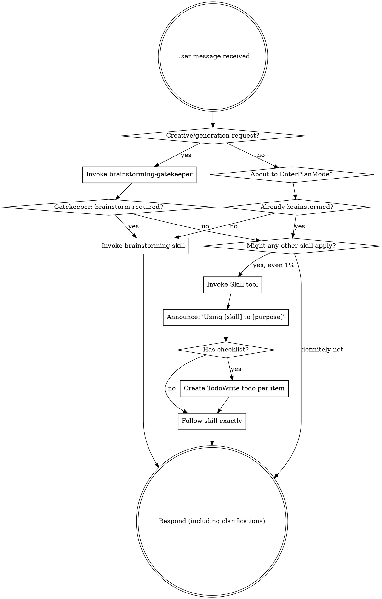

# Brainstorming Validation System Implementation Plan

> **For agentic workers:** REQUIRED SUB-SKILL: Use petropowers:subagent-driven-development (recommended) or petropowers:executing-plans to implement this plan task-by-task. Steps use checkbox (`- [ ]`) syntax for tracking.

**Goal:** Enforce brainstorming skill invocation for creative/generative tasks through a three-layer validation system.

**Architecture:** Pre-flight gatekeeper skill analyzes requests for creative triggers, enhanced using-petropowers adds hard gates and red flags, post-response audit hook catches violations and logs them.

**Tech Stack:** Markdown skills, Bash hooks, JSON configuration

**Spec:** `docs/petropowers/specs/2026-04-06-brainstorming-validation-design.md`

---

## File Structure

| File | Purpose |
|------|---------|
| `skills/brainstorming-gatekeeper/SKILL.md` | New skill - pre-flight detection of brainstorming requirements |
| `skills/using-petropowers/SKILL.md` | Modify - add hard gate, triggers table, red flags |
| `hooks/audit-brainstorming/audit.sh` | New hook - post-response violation detection |
| `hooks/hooks.json` | Modify - add PostResponse hook entry |

---

## Chunk 1: Gatekeeper Skill

### Task 1: Create Brainstorming Gatekeeper Skill

**Files:**
- Create: `skills/brainstorming-gatekeeper/SKILL.md`

- [ ] **Step 1: Create skill directory**

```bash
mkdir -p skills/brainstorming-gatekeeper
```

- [ ] **Step 2: Write the gatekeeper skill content**

Create `skills/brainstorming-gatekeeper/SKILL.md`:

```markdown
---
name: brainstorming-gatekeeper
description: Pre-flight check that determines if brainstorming is required before any action. Invoke this FIRST for any request involving creative or generative work.
---

# Skill: Brainstorming Gatekeeper

Pre-flight check that analyzes user requests and determines if brainstorming is required before any action.

## When to Invoke

Invoke this skill when the user request contains ANY of:
- Creative keywords (generate, create, build, implement, add, develop, make, set up, write, design)
- Oil & gas domain terms (reservoir, well, seismic, production, drilling, LAS, SEG-Y, WITSML, pipeline)
- Missing critical details (no size, format, location, constraints specified)

## Trigger Detection

### Keywords Table

| Category | Triggers |
|----------|----------|
| **Creative** | generate, create, build, implement, add, develop, make, set up, write, design, construct, establish |
| **Oil & Gas** | reservoir, well, seismic, production, drilling, LAS, SEG-Y, WITSML, PRODML, pipeline, formation, porosity, permeability, logs, survey |
| **Ambiguity** | Missing: size, format, location, constraints, data type, time range, count, structure |

### Decision Logic

```
IF (has_creative_keyword AND has_domain_context) 
   OR (has_creative_keyword AND has_ambiguity)
   OR (has_domain_context AND has_ambiguity)
THEN → brainstorming required
ELSE → proceed directly
```

## Your Task

Analyze the user's request against the triggers above. Then output ONE of:

### Output A: Brainstorming Required

```markdown
## Gatekeeper Decision: Brainstorming Required

**Triggers detected:**
- Keyword: [list detected creative keywords]
- Domain: [list detected domain terms]
- Ambiguity: [list missing details]

**Action:** Invoke brainstorming skill before proceeding.
Do NOT execute any implementation actions.
```

Then immediately invoke the `brainstorming` skill.

### Output B: Proceed Directly

```markdown
## Gatekeeper Decision: Proceed

**Analysis:** [Brief explanation why this is not creative work]
**Action:** Continue with appropriate skill or direct response.
```

Then continue with the appropriate action.

## Exceptions (Skip Brainstorming)

These requests do NOT require brainstorming:
- Pure information queries ("What is porosity?", "Explain SEG-Y format")
- Analysis of existing data ("Analyze this LAS file", "Read this SEG-Y")
- Simple file operations ("Read this file", "List directory contents")
- Status checks ("What's in this folder?", "Show git status")
- Follow-up to existing brainstorming session (design already approved)
- Bug fixes with clear reproduction steps
- Code review responses

## Examples

**Request:** "I work on ppr-1 reservoir and need to generate data for the reservoir"

**Analysis:**
- Keyword: "generate" ✓
- Domain: "reservoir" ✓
- Ambiguity: missing data type, format, size ✓

**Decision:** Brainstorming Required

---

**Request:** "What does the GR curve in a well log represent?"

**Analysis:**
- Keyword: none
- Domain: "well log", "GR curve" (but informational)
- Ambiguity: N/A (question, not task)

**Decision:** Proceed (informational query)

---

**Request:** "Read the LAS file in data/well-1.las and show the curves"

**Analysis:**
- Keyword: "read", "show" (not creative)
- Domain: "LAS file" (but analysis, not creation)
- Ambiguity: file path specified

**Decision:** Proceed (analysis of existing data)
```

- [ ] **Step 3: Verify skill file exists and has correct structure**

```bash
cat skills/brainstorming-gatekeeper/SKILL.md | head -20
```

Expected: File shows frontmatter with name and description.

- [ ] **Step 4: Commit the gatekeeper skill**

```bash
git add skills/brainstorming-gatekeeper/SKILL.md
git commit -m "feat: add brainstorming-gatekeeper skill for pre-flight validation"
```

---

## Chunk 2: Enhanced using-petropowers

### Task 2: Add Hard Gate to using-petropowers

**Files:**
- Modify: `skills/using-petropowers/SKILL.md:16-17` (after EXTREMELY-IMPORTANT block)

- [ ] **Step 1: Read current file to find insertion point**

```bash
grep -n "EXTREMELY-IMPORTANT" skills/using-petropowers/SKILL.md
```

Expected: Shows line numbers for the EXTREMELY-IMPORTANT block.

- [ ] **Step 2: Insert HARD-GATE block after line 16**

Insert after the closing `</EXTREMELY-IMPORTANT>` tag (line 16):

```markdown

<HARD-GATE>
If a request involves GENERATING, CREATING, or BUILDING anything:
1. STOP
2. Invoke brainstorming-gatekeeper skill
3. Follow gatekeeper's verdict
4. Do NOT proceed to implementation without this check

This applies to ALL creative work regardless of perceived simplicity.
</HARD-GATE>
```

- [ ] **Step 3: Verify insertion**

```bash
grep -A 8 "HARD-GATE" skills/using-petropowers/SKILL.md
```

Expected: Shows the HARD-GATE block content.

- [ ] **Step 4: Commit the hard gate addition**

```bash
git add skills/using-petropowers/SKILL.md
git commit -m "feat: add HARD-GATE for creative work in using-petropowers"
```

### Task 3: Add Brainstorming Triggers Table to using-petropowers

**Files:**
- Modify: `skills/using-petropowers/SKILL.md:46-47` (after "The Rule" section header)

- [ ] **Step 1: Find insertion point after "The Rule" section**

```bash
grep -n "## The Rule" skills/using-petropowers/SKILL.md
```

Expected: Shows line number for "The Rule" section.

- [ ] **Step 2: Insert Brainstorming Triggers section after the flow diagram (after line 76)**

Insert after the closing triple-backtick of the dot diagram:

```markdown

## Brainstorming Triggers

Before ANY action, check if the request matches these patterns:

| Pattern Type | Examples | Action |
|--------------|----------|--------|
| Creative keywords | generate, create, build, implement, add, develop | Invoke gatekeeper |
| Oil & gas terms | reservoir, well, seismic, LAS, SEG-Y, drilling, production | Invoke gatekeeper |
| Missing details | no size, no format, no location, no constraints | Invoke gatekeeper |

If ANY pattern matches → invoke `brainstorming-gatekeeper` skill FIRST.
```

- [ ] **Step 3: Verify insertion**

```bash
grep -A 10 "## Brainstorming Triggers" skills/using-petropowers/SKILL.md
```

Expected: Shows the triggers table.

- [ ] **Step 4: Commit the triggers table**

```bash
git add skills/using-petropowers/SKILL.md
git commit -m "feat: add brainstorming triggers table to using-petropowers"
```

### Task 4: Add Red Flags for Skipping Gatekeeper

**Files:**
- Modify: `skills/using-petropowers/SKILL.md` (Red Flags table, around line 82-95)

- [ ] **Step 1: Find the Red Flags table**

```bash
grep -n "I know what that means" skills/using-petropowers/SKILL.md
```

Expected: Shows line number for the last row of the Red Flags table.

- [ ] **Step 2: Add new red flag rows after "I know what that means" row**

Insert after the last row of the table:

```markdown
| "I can just generate this quickly" | Creative work requires brainstorming. Check gatekeeper. |
| "The request is clear enough" | Missing details = ambiguity. Check gatekeeper. |
| "This is simple data generation" | Data generation is creative work. Brainstorm first. |
| "I'll just explore first then decide" | Gatekeeper check comes BEFORE exploration. |
```

- [ ] **Step 3: Verify the table has new rows**

```bash
grep -A 2 "I can just generate" skills/using-petropowers/SKILL.md
```

Expected: Shows the new red flag rows.

- [ ] **Step 4: Commit the red flags addition**

```bash
git add skills/using-petropowers/SKILL.md
git commit -m "feat: add red flags for skipping brainstorming gatekeeper"
```

### Task 5: Update Flow Diagram in using-petropowers

**Files:**
- Modify: `skills/using-petropowers/SKILL.md:48-76` (the dot diagram)

- [ ] **Step 1: Replace the existing dot diagram**

Replace the entire dot diagram (lines 48-76) with:



- [ ] **Step 2: Verify the diagram was updated**

```bash
grep "Creative/generation request" skills/using-petropowers/SKILL.md
```

Expected: Shows the new diamond node.

- [ ] **Step 3: Commit the flow diagram update**

```bash
git add skills/using-petropowers/SKILL.md
git commit -m "feat: update flow diagram with gatekeeper check"
```

---

## Chunk 3: Audit Hook

### Task 6: Create Audit Hook Directory and Script

**Files:**
- Create: `hooks/audit-brainstorming/audit.sh`

- [ ] **Step 1: Create audit hook directory**

```bash
mkdir -p hooks/audit-brainstorming
```

- [ ] **Step 2: Write the audit script**

Create `hooks/audit-brainstorming/audit.sh`:

```bash
#!/usr/bin/env bash
# PostResponse hook for brainstorming compliance audit
# Checks if agent should have invoked brainstorming but didn't

set -euo pipefail

SCRIPT_DIR="$(cd "$(dirname "$0")" && pwd)"
PLUGIN_ROOT="$(cd "${SCRIPT_DIR}/../.." && pwd)"
LOG_FILE="${PLUGIN_ROOT}/logs/brainstorming-audit.log"

# Ensure logs directory exists
mkdir -p "${PLUGIN_ROOT}/logs"

# Read input from environment (set by hook runner)
USER_MESSAGE="${CLAUDE_USER_MESSAGE:-}"
ASSISTANT_MESSAGE="${CLAUDE_ASSISTANT_MESSAGE:-}"
TOOL_CALLS="${CLAUDE_TOOL_CALLS:-[]}"

# If no user message, nothing to audit
if [ -z "$USER_MESSAGE" ]; then
    echo '{"status": "skipped", "reason": "no user message"}'
    exit 0
fi

# Trigger patterns (lowercase for matching)
CREATIVE_KEYWORDS="generate|create|build|implement|add|develop|make|set up|write|design"
DOMAIN_KEYWORDS="reservoir|well|seismic|production|drilling|las|seg-y|segy|witsml|prodml|pipeline|formation|porosity|permeability"
IMPLEMENTATION_TOOLS="Write|Bash"

# Convert to lowercase for matching
user_lower=$(echo "$USER_MESSAGE" | tr '[:upper:]' '[:lower:]')
assistant_lower=$(echo "$ASSISTANT_MESSAGE" | tr '[:upper:]' '[:lower:]')

# Check for triggers in user message
has_creative=false
has_domain=false

if echo "$user_lower" | grep -qE "$CREATIVE_KEYWORDS"; then
    has_creative=true
fi

if echo "$user_lower" | grep -qE "$DOMAIN_KEYWORDS"; then
    has_domain=true
fi

# Check if brainstorming was invoked
brainstorming_invoked=false
if echo "$assistant_lower" | grep -qE "brainstorming(-gatekeeper)?.*skill|using.*brainstorming"; then
    brainstorming_invoked=true
fi

# Check if implementation tools were used
implementation_used=false
if echo "$TOOL_CALLS" | grep -qE "$IMPLEMENTATION_TOOLS"; then
    implementation_used=true
fi

# Determine if this is a violation
violation=false
violation_reason=""

if [ "$has_creative" = true ] && [ "$has_domain" = true ]; then
    if [ "$brainstorming_invoked" = false ] && [ "$implementation_used" = true ]; then
        violation=true
        violation_reason="Creative+domain request with implementation but no brainstorming"
    fi
fi

# Log and output
timestamp=$(date -u +"%Y-%m-%dT%H:%M:%SZ")

if [ "$violation" = true ]; then
    # Log the violation
    echo "[$timestamp] VIOLATION: $violation_reason" >> "$LOG_FILE"
    echo "  Request: ${USER_MESSAGE:0:200}..." >> "$LOG_FILE"
    echo "  Triggers: creative=$has_creative, domain=$has_domain" >> "$LOG_FILE"
    echo "" >> "$LOG_FILE"
    
    # Output for hook system
    cat <<EOF
{
  "status": "violation",
  "violations": [
    {
      "type": "skipped_brainstorming",
      "evidence": "$violation_reason",
      "triggers": {
        "creative": $has_creative,
        "domain": $has_domain
      }
    }
  ],
  "additionalContext": "<system-warning>Previous response violated brainstorming requirement. Request contained creative+domain triggers but agent skipped brainstorming and proceeded to implementation. Please invoke brainstorming skill for creative/generative tasks.</system-warning>"
}
EOF
else
    # Log compliance (optional, can be removed for less noise)
    if [ "$has_creative" = true ] || [ "$has_domain" = true ]; then
        echo "[$timestamp] COMPLIANT: Triggers present, brainstorming_invoked=$brainstorming_invoked, implementation_used=$implementation_used" >> "$LOG_FILE"
    fi
    
    echo '{"status": "compliant"}'
fi

exit 0
```

- [ ] **Step 3: Make the script executable**

```bash
chmod +x hooks/audit-brainstorming/audit.sh
```

- [ ] **Step 4: Verify script is executable and has correct shebang**

```bash
head -5 hooks/audit-brainstorming/audit.sh && ls -la hooks/audit-brainstorming/audit.sh
```

Expected: Shows shebang line and executable permissions.

- [ ] **Step 5: Commit the audit script**

```bash
git add hooks/audit-brainstorming/audit.sh
git commit -m "feat: add brainstorming audit hook script"
```

### Task 7: Update hooks.json with PostResponse Hook

**Files:**
- Modify: `hooks/hooks.json`

- [ ] **Step 1: Read current hooks.json**

```bash
cat hooks/hooks.json
```

Expected: Shows current SessionStart hook configuration.

- [ ] **Step 2: Update hooks.json to add PostResponse hook**

Replace entire `hooks/hooks.json` with:

```json
{
  "hooks": {
    "SessionStart": [
      {
        "matcher": "startup|clear|compact",
        "hooks": [
          {
            "type": "command",
            "command": "\"${CLAUDE_PLUGIN_ROOT}/hooks/run-hook.cmd\" session-start",
            "async": false
          }
        ]
      }
    ],
    "PostResponse": [
      {
        "matcher": ".*",
        "hooks": [
          {
            "type": "command",
            "command": "\"${CLAUDE_PLUGIN_ROOT}/hooks/audit-brainstorming/audit.sh\"",
            "async": true
          }
        ]
      }
    ]
  }
}
```

- [ ] **Step 3: Validate JSON syntax**

```bash
python3 -c "import json; json.load(open('hooks/hooks.json'))" && echo "JSON valid"
```

Expected: "JSON valid"

- [ ] **Step 4: Commit the hooks.json update**

```bash
git add hooks/hooks.json
git commit -m "feat: add PostResponse hook for brainstorming audit"
```

---

## Chunk 4: Testing and Verification

### Task 8: Manual Testing of Gatekeeper Skill

**Files:**
- Test: `skills/brainstorming-gatekeeper/SKILL.md`

- [ ] **Step 1: Verify skill is discoverable**

Start a new Claude Code session and check if the skill appears in available skills list.

```bash
# In a new terminal/session, the skill should be listed
ls skills/*/SKILL.md | grep gatekeeper
```

Expected: Shows `skills/brainstorming-gatekeeper/SKILL.md`

- [ ] **Step 2: Test gatekeeper with creative+domain request**

In a new Claude Code session, send:
> "I need to generate synthetic well log data for testing"

Expected behavior:
1. Agent invokes brainstorming-gatekeeper skill
2. Gatekeeper detects: "generate" (creative), "well log" (domain)
3. Gatekeeper outputs "Brainstorming Required"
4. Agent invokes brainstorming skill
5. Agent asks clarifying questions before implementation

- [ ] **Step 3: Test gatekeeper with simple query**

In a new Claude Code session, send:
> "What is porosity in oil and gas context?"

Expected behavior:
1. Agent may invoke gatekeeper (due to domain term)
2. Gatekeeper outputs "Proceed" (informational query)
3. Agent answers directly without brainstorming

- [ ] **Step 4: Document test results**

Record pass/fail for each test case.

### Task 9: Manual Testing of Audit Hook

**Files:**
- Test: `hooks/audit-brainstorming/audit.sh`

- [ ] **Step 1: Test audit script directly with mock input**

```bash
export CLAUDE_USER_MESSAGE="generate reservoir data for testing"
export CLAUDE_ASSISTANT_MESSAGE="I'll create the synthetic data now using Write tool"
export CLAUDE_TOOL_CALLS='[{"name": "Write", "input": {"path": "data/test.las"}}]'
./hooks/audit-brainstorming/audit.sh
```

Expected: Output shows `"status": "violation"`

- [ ] **Step 2: Test audit script with compliant response**

```bash
export CLAUDE_USER_MESSAGE="generate reservoir data for testing"
export CLAUDE_ASSISTANT_MESSAGE="Using brainstorming skill to understand requirements"
export CLAUDE_TOOL_CALLS='[{"name": "Skill", "input": {"name": "brainstorming"}}]'
./hooks/audit-brainstorming/audit.sh
```

Expected: Output shows `"status": "compliant"`

- [ ] **Step 3: Check log file was created**

```bash
cat logs/brainstorming-audit.log
```

Expected: Shows logged violations from test runs.

- [ ] **Step 4: Clean up test log**

```bash
rm -f logs/brainstorming-audit.log
```

### Task 10: Final Verification and Cleanup

- [ ] **Step 1: Verify all files are committed**

```bash
git status
```

Expected: Clean working directory, nothing to commit.

- [ ] **Step 2: Review commit history**

```bash
git log --oneline -10
```

Expected: Shows commits for gatekeeper skill, using-petropowers updates, and audit hook.

- [ ] **Step 3: Run final smoke test**

Start fresh Claude Code session with the test request:
> "I work on ppr-1 reservoir and need to generate data for the reservoir, use separate folder to the data."

Expected:
1. Gatekeeper invoked
2. Brainstorming required detected
3. Brainstorming skill invoked
4. Agent asks clarifying questions about data type, format, size
5. No immediate implementation

- [ ] **Step 4: Document completion**

Update the spec document status or create a completion note.

---

## Summary

| Chunk | Tasks | Description |
|-------|-------|-------------|
| 1 | Task 1 | Create brainstorming-gatekeeper skill |
| 2 | Tasks 2-5 | Enhance using-petropowers with hard gate, triggers, red flags, flow diagram |
| 3 | Tasks 6-7 | Create audit hook and update hooks.json |
| 4 | Tasks 8-10 | Testing and verification |

**Total tasks:** 10
**Estimated time:** 45-60 minutes
