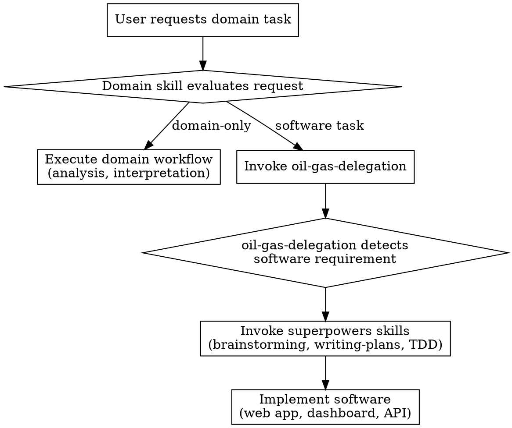

# Oil & Gas AI Skills Framework Design

## Overview

A domain-specific AI skills framework for the oil & gas industry, built on superpowers. Provides specialized skills for industry pipelines (exploration, drilling, reservoir, midstream, refining) while delegating software development tasks to existing superpowers skills.

## Architecture

**Approach: Hierarchical with Delegation Layer**

```
skills/
├── oil-gas-foundation/              # Core industry knowledge
├── oil-gas-delegation/               # Routes software tasks to superpowers
├── oil-gas-pipelines/
│   ├── exploration/
│   ├── drilling/
│   ├── reservoir-production/
│   ├── midstream/
│   └── refining/
└── oil-gas-cross-cutting/
    ├── segy-operations/
    ├── well-log-analysis/
    └── scada-timeseries/
```

**Integration:**
- Each domain skill references `oil-gas-delegation` for software tasks
- `oil-gas-delegation` invokes appropriate superpowers skills (brainstorming, writing-plans, TDD, etc.)
- Domain skills handle interpretation, analysis, optimization recommendations
- Software tasks (web apps, dashboards, data pipelines) delegate to superpowers workflow

## Components

### Foundation Layer

#### `oil-gas-foundation/SKILL.md`

Core industry knowledge shared across all pipeline skills:
- Industry overview (upstream/midstream/downstream)
- Role hierarchy and terminology
- End-to-end data flow (acquisition → ingestion → processing → interpretation → modeling → decision → execution → feedback)
- Common data formats (LAS, SEG-Y, WITSML, PRODML)
- Safety culture and regulatory context

Referenced by all pipeline skills, not directly invoked by agents.

#### `oil-gas-delegation/SKILL.md`

Meta-skill that detects software tasks and routes to superpowers:

**Detection logic:**
```
if request involves: web app, report dashboard, visualization, API, database schema, data pipeline, automation script:
    → delegate to software development workflow
    → invoke brainstorming → writing-plans → TDD workflow
else:
    → handle within domain skill
```

**Mapped workflows:**
- Web app/dashboard → brainstorming → writing-plans → subagent-driven-development
- Data pipeline → brainstorming → writing-plans → TDD
- Code/automation → TDD workflow directly
- Domain analysis (no software) → stay in domain skill

### Cross-Cutting Data Skills

#### `oil-gas-cross-cutting/segy-operations/SKILL.md`

SEG-Y seismic data operations based on Equinor's segyio-notebooks.

**Capabilities:**
- Read SEG-Y files into NumPy arrays
- Extract binary and trace headers to pandas DataFrames
- Visualize seismic data (time slices, sections, headers)
- Manipulate trace length (resampling, cutting)
- Create derivative volumes (similarity → discontinuity/fault)
- Write SEG-Y files with header reuse

**Code patterns:**
```python
import segyio
import numpy as np

with segyio.open('data.sgy', 'r') as segyfile:
    data = segyio.tools.cube(segyfile)
    headers_df = pd.DataFrame(segyfile.header)
```

**Reference materials:**
- https://github.com/equinor/segyio-notebooks
- `notebooks/basic/01_basic_tutorial.ipynb` - Complete workflow
- `notebooks/basic/02_segy_quicklook.ipynb` - Header analysis
- `notebooks/basic/03_basic_segy_editing.ipynb` - Trace manipulation
- `notebooks/pylops/01_seismic_inversion.ipynb` - Inversion workflow

**Integration points:**
- Used by exploration skill for seismic interpretation
- Used by reservoir skill for horizon picking
- Outputs feed visualization dashboards (delegates to superpowers)

#### `oil-gas-cross-cutting/well-log-analysis/SKILL.md`

Well log analysis using lasio library.

**Capabilities:**
- Read LAS files (LAS 1.2 and 2.0, partial LAS 3.0)
- Export to pandas DataFrame, CSV, Excel
- Handle malformed/non-compliant LAS files
- Header section metadata extraction
- Curve data manipulation and quality control

**Code patterns:**
```python
import lasio

log = lasio.read('well_log.las')
df = log.df()
well_name = log.well['WELL'].value
log.to_csv('output.csv')
```

**Reference materials:**
- https://lasio.readthedocs.io/en/stable/
- https://github.com/agilescientific/welly (extended functionality)

#### `oil-gas-cross-cutting/scada-timeseries/SKILL.md`

SCADA and time-series data handling.

**Capabilities:**
- Handle WITSML/PRODML data streams
- Real-time sensor data processing
- Time-series quality flags
- Anomaly detection patterns

### Pipeline Skills

Each pipeline skill follows a consistent template.

#### `oil-gas-pipelines/exploration/SKILL.md`

**Roles:** Geologist, Geophysicist, Petrophysicist, Seismic Interpreter

**Data types:**
- Seismic data (SEG-Y)
- Well logs (LAS)
- Geological models
- Core samples
- Satellite & gravity data

**Workflow:**
1. Seismic acquisition and quality check
2. Seismic interpretation (horizon picking, fault detection)
3. Well log correlation
4. Prospect identification
5. Risk assessment (probability of success)

**Outputs:**
- Prospect maps
- Drilling targets
- Probability of success estimates

**Domain tasks (handled by this skill):**
- Interpret seismic sections
- Analyze well logs for formation evaluation
- Estimate reservoir size and reserves
- Assess geological risk

**Software tasks (delegate to superpowers):**
- Seismic visualization dashboards
- Prospect database web applications
- Automated report generation

#### `oil-gas-pipelines/drilling/SKILL.md`

**Roles:** Drilling Engineer, Mud Engineer, Well Planner, Rig Supervisor

**Data types:**
- MWD/LWD real-time data
- Mud logs
- Drilling parameters (WOB, RPM, torque)
- Well trajectory data

**Workflow:**
1. Well planning and trajectory design
2. Drilling parameter optimization
3. Real-time monitoring and alerts
4. Post-well analysis

**Outputs:**
- Wellbore (physical)
- Drilling reports
- Real-time alerts (kicks, losses, stuck pipe)

**Safety focus:**
- Kick detection and well control
- Borehole stability monitoring
- Equipment failure prevention

**Domain tasks:**
- Optimize rate of penetration (ROP)
- Monitor real-time drilling conditions
- Assess borehole stability

**Software tasks:**
- Real-time monitoring dashboards
- Drilling parameter databases
- Automated reporting systems

#### `oil-gas-pipelines/reservoir-production/SKILL.md`

**Roles:** Reservoir Engineer, Production Engineer, Well Intervention Engineer

**Data types:**
- Production rates (oil/gas/water)
- Pressure and temperature data
- SCADA data
- Reservoir simulation models

**Workflow:**
1. Reservoir characterization
2. Production forecasting
3. Well optimization
4. Reservoir monitoring

**Outputs:**
- Production plans
- Recovery strategies
- Well intervention recommendations

**Domain tasks:**
- Forecast production decline
- Optimize artificial lift
- Analyze reservoir pressure behavior

**Software tasks:**
- Production dashboards
- Forecast models in web apps
- Allocation systems

#### `oil-gas-pipelines/midstream/SKILL.md`

**Roles:** Pipeline Engineer, Operations Manager, Integrity Engineer

**Data types:**
- Flow rates
- Pressure data
- ILI (inline inspection) data
- Leak detection signals

**Workflow:**
1. Transport scheduling
2. Leak detection and monitoring
3. Integrity management
4- Maintenance planning

**Outputs:**
- Transport schedules
- Maintenance plans
- Incident alerts

**Domain tasks:**
- Detect pipeline anomalies
- Optimize flow efficiency
- Plan integrity assessments

**Software tasks:**
- Pipeline monitoring dashboards
- ILI data visualization
- Compliance tracking systems

#### `oil-gas-pipelines/refining/SKILL.md`

**Roles:** Process Engineer, Chemical Engineer, Plant Operator

**Data types:**
- Crude composition
- Temperature/pressure readings
- Process simulation models
- Product quality metrics

**Workflow:**
1. Crude analysis and selection
2. Process optimization
3. Product quality control
4- Yield maximization

**Outputs:**
- Gasoline, diesel, chemicals
- Refinery optimization plans
- Product specifications

**Domain tasks:**
- Optimize distillation cut points
- Monitor product quality
- Analyze crude blend economics

**Software tasks:**
- Process monitoring dashboards
- Quality tracking systems
- Optimization tools

## Skill Content Structure

Each pipeline skill SKILL.md contains:

1. **Purpose** - What the skill enables
2. **Roles** - Who uses this skill
3. **Data types** - Input data formats with references to cross-cutting skills
4. **Workflow** - Step-by-step domain workflow
5. **Outputs** - What the workflow produces
6. **Domain tasks** - Tasks handled by this skill (interpretation, analysis, optimization recommendations)
7. **Software tasks** - Tasks that trigger `oil-gas-delegation`
8. **Safety considerations** - Industry-specific safety context
9. **Checklists** - Quality gates for domain work

## Delegation Flow



## Implementation Phases

This framework will be built incrementally in 5 phases:

1. **Skeleton Creation** - Create all skill directories and SKILL.md files with minimal content (purpose, roles, data types, workflow outline), reference external libraries
2. **Delegation Skill** - Implement `oil-gas-delegation` detection logic, test routing to superpowers skills, validate delegation flow
3. **Cross-Cutting Skills** - Flesh out segy-operations, well-log-analysis, scada-timeseries with working code patterns
4. **Pipeline Skills** - Complete each pipeline skill with domain workflows, checklists, safety considerations
5. **Extract to Plugin** - Once stable, extract framework to standalone plugin, maintain superpowers integration

## Success Criteria

- All 10 skills created with skeletal content
- Delegation skill correctly routes software tasks to superpowers
- Domain tasks handled within domain skills
- Cross-cutting skills provide working code patterns
- Pipeline skills guide domain workflows end-to-end
- Integration with segyio-notebooks and lasio documented