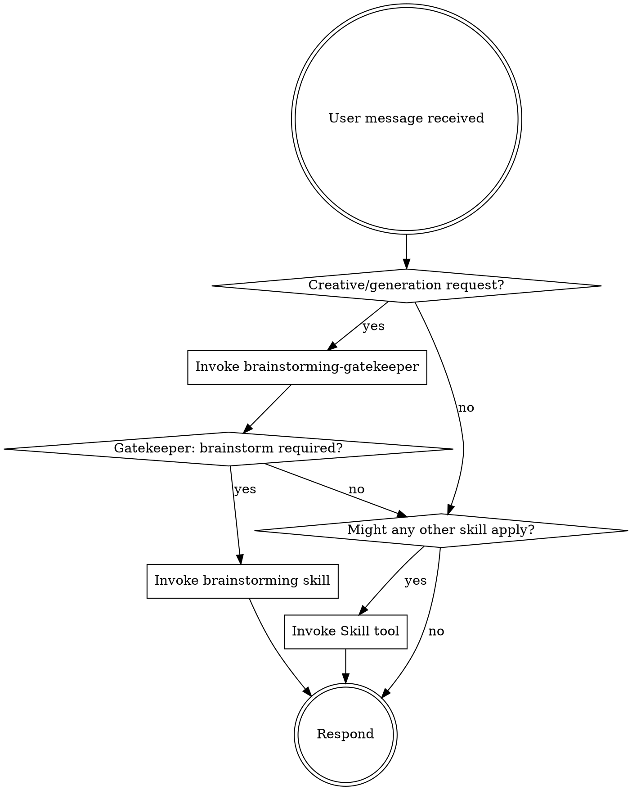

# Brainstorming Validation System Design

## Overview

A multi-layered validation system to ensure agents invoke the brainstorming skill before executing creative or generative tasks. The system addresses a critical failure mode: agents jumping directly to implementation without exploring context, asking clarifying questions, or proposing approaches.

## Problem Statement

When given requests like:

> "I work on ppr-1 reservoir and need to generate data for the reservoir, use separate folder to the data."

Agents often:
- Skip context exploration (don't check existing folders)
- Skip clarifying questions (don't ask about size, format, data type)
- Skip approach proposals (don't offer alternatives)
- Jump directly to implementation (start generating synthetic data immediately)

This violates the brainstorming skill workflow and produces suboptimal results.

## Solution Architecture

Three-layer validation:

1. **Pre-flight (Gatekeeper Skill)** - Intercepts requests before execution
2. **Reinforcement (Enhanced using-petropowers)** - Hard gate in the base skill
3. **Post-hoc (Audit Hook)** - Catches violations after response

```
┌─────────────────────────────────────────────────────────────────────┐
│                         User Request                                 │
└─────────────────────────────────────────────────────────────────────┘
                                  │
                                  ▼
┌─────────────────────────────────────────────────────────────────────┐
│              using-petropowers (SessionStart)                        │
│  ┌────────────────────────────────────────────────────────────────┐ │
│  │  HARD GATE: Check for creative/generation keywords              │ │
│  │  → If matched: invoke brainstorming-gatekeeper                  │ │
│  └────────────────────────────────────────────────────────────────┘ │
└─────────────────────────────────────────────────────────────────────┘
                                  │
                                  ▼
┌─────────────────────────────────────────────────────────────────────┐
│              brainstorming-gatekeeper (PRE-FLIGHT)                   │
│  ┌────────────────────────────────────────────────────────────────┐ │
│  │  Analyze: keywords + domain + ambiguity                         │ │
│  │  Decision: brainstorming required? yes/no                       │ │
│  └────────────────────────────────────────────────────────────────┘ │
└─────────────────────────────────────────────────────────────────────┘
                                  │
                    ┌─────────────┴─────────────┐
                    ▼                           ▼
          ┌─────────────────┐         ┌─────────────────┐
          │   Brainstorming │         │ Proceed Direct  │
          │   Required      │         │ (simple tasks)  │
          └─────────────────┘         └─────────────────┘
                    │                           │
                    ▼                           │
          ┌─────────────────┐                   │
          │   brainstorming │                   │
          │   skill         │                   │
          └─────────────────┘                   │
                    │                           │
                    ▼                           ▼
┌─────────────────────────────────────────────────────────────────────┐
│                        Agent Response                                │
└─────────────────────────────────────────────────────────────────────┘
                                  │
                                  ▼
┌─────────────────────────────────────────────────────────────────────┐
│              audit-brainstorming (POST-HOC)                          │
│  ┌────────────────────────────────────────────────────────────────┐ │
│  │  Check: Did gatekeeper run? Did brainstorming run?              │ │
│  │  Check: Implementation without design?                          │ │
│  │  Output: compliant | violation + log                            │ │
│  └────────────────────────────────────────────────────────────────┘ │
└─────────────────────────────────────────────────────────────────────┘
```

## Component 1: Brainstorming Gatekeeper Skill

### Location

`skills/brainstorming-gatekeeper/SKILL.md`

### Purpose

Pre-flight check that analyzes user requests and determines if brainstorming is required before any action.

### Trigger Detection Rules

| Category | Triggers | Examples |
|----------|----------|----------|
| **Keywords** | generate, create, build, implement, add, develop, make, set up, write, design | "generate data for reservoir" |
| **Oil & Gas Domain** | reservoir, well, seismic, production, drilling, LAS, SEG-Y, WITSML, pipeline, formation, porosity, permeability | "ppr-1 reservoir data" |
| **Ambiguity Signals** | Missing: size, format, location, constraints, data type, time range, number of records | No folder specified, no data format |
| **Creative Work** | feature, component, functionality, system, tool, dashboard, application, script, pipeline | "build a monitoring tool" |

### Decision Logic

```
IF (has_creative_keyword AND has_domain_context) 
   OR (has_creative_keyword AND has_ambiguity)
   OR (has_domain_context AND has_ambiguity)
THEN → brainstorming required
ELSE → proceed directly
```

### Output

**Brainstorming Required:**
```markdown
## Gatekeeper Decision: Brainstorming Required

**Triggers detected:**
- Keyword: "generate"
- Domain: "reservoir"
- Ambiguity: missing data format, missing size

**Action:** Invoke brainstorming skill before proceeding.
Do NOT execute any implementation actions.
```

**Proceed Directly:**
```markdown
## Gatekeeper Decision: Proceed

**Analysis:** Request is a simple query/analysis with no creative work.
**Action:** Continue with appropriate skill or direct response.
```

### Exceptions (Skip Brainstorming)

- Pure information queries ("What is porosity?")
- Analysis of existing data ("Analyze this LAS file")
- Simple file operations ("Read this file")
- Status checks ("What's in this folder?")
- Follow-up to existing brainstorming session

## Component 2: Enhanced using-petropowers

### Location

`skills/using-petropowers/SKILL.md` (modify existing)

### Changes

#### 1. Add Hard Gate Section

Insert after the EXTREMELY-IMPORTANT block:

```markdown
<HARD-GATE>
If a request involves GENERATING, CREATING, or BUILDING anything:
1. STOP
2. Invoke brainstorming-gatekeeper skill
3. Follow gatekeeper's verdict
4. Do NOT proceed to implementation without this check

This applies to ALL creative work regardless of perceived simplicity.
</HARD-GATE>
```

#### 2. Add Brainstorming Triggers Table

New section after "The Rule":

```markdown
## Brainstorming Triggers

Before ANY action, check if the request matches these patterns:

| Pattern Type | Examples | Action |
|--------------|----------|--------|
| Creative keywords | generate, create, build, implement, add, develop | Invoke gatekeeper |
| Oil & gas terms | reservoir, well, seismic, LAS, SEG-Y, drilling, production | Invoke gatekeeper |
| Missing details | no size, no format, no location, no constraints | Invoke gatekeeper |

If ANY pattern matches → invoke `brainstorming-gatekeeper` skill FIRST.
```

#### 3. Add Red Flags for Skipping Gatekeeper

Add to existing Red Flags table:

| Thought | Reality |
|---------|---------|
| "I can just generate this quickly" | Creative work requires brainstorming. Check gatekeeper. |
| "The request is clear enough" | Missing details = ambiguity. Check gatekeeper. |
| "This is simple data generation" | Data generation is creative work. Brainstorm first. |
| "I'll just explore first then decide" | Gatekeeper check comes BEFORE exploration. |

#### 4. Update Flow Diagram

Update the dot diagram to include gatekeeper as first step:



## Component 3: Post-Audit Hook

### Location

- `hooks/audit-brainstorming/audit.sh` (new)
- `hooks/hooks.json` (modify)

### Purpose

Post-hoc validation that catches violations the gatekeeper missed or when gatekeeper wasn't invoked.

### When It Runs

After agent completes a response (PostResponse hook event).

### Input Data

The PostResponse hook receives context via environment variables and stdin:
- `CLAUDE_USER_MESSAGE` - The original user request (for trigger analysis)
- `CLAUDE_ASSISTANT_MESSAGE` - The agent's response (for skill invocation detection)
- `CLAUDE_TOOL_CALLS` - JSON array of tool calls made (for implementation detection)

The audit script parses these to perform validation checks.

### Validation Checks

| Check | How | Violation Condition |
|-------|-----|---------------------|
| **Gatekeeper invoked?** | Scan response for "brainstorming-gatekeeper" skill invocation | Request matched triggers but gatekeeper not invoked |
| **Brainstorming invoked?** | Scan response for "brainstorming" skill invocation | Creative task but brainstorming not invoked |
| **Implementation without design?** | Detect Write/Bash tool calls that create files/generate data | Implementation tools used without prior brainstorming |
| **Context exploration?** | Detect Read/Glob calls before implementation | Skipped context gathering |
| **Questions asked?** | Detect clarifying questions in response | Acted without gathering requirements |

### Violation Detection Logic

```
VIOLATION if:
  - Request matched gatekeeper triggers (keyword + domain + ambiguity)
  - AND agent did NOT invoke brainstorming skill
  - AND agent DID call implementation tools (Write, Bash with generation)
```

### Output Format

```json
{
  "status": "violation" | "compliant",
  "violations": [
    {
      "type": "skipped_brainstorming",
      "evidence": "Agent called Write tool to create synthetic data without brainstorming",
      "request_triggers": ["generate", "reservoir", "missing: data format"]
    }
  ],
  "recommendation": "Invoke brainstorming skill before generating data"
}
```

### Actions on Violation

1. **Log violation** to `logs/brainstorming-audit.log` with timestamp, request, and evidence
2. **Inject warning** into next agent context via hook output:
   ```
   <system-warning>
   Previous response violated brainstorming requirement.
   Request contained triggers: [generate, reservoir, missing details]
   But agent skipped brainstorming and proceeded to implementation.
   Please invoke brainstorming skill for creative/generative tasks.
   </system-warning>
   ```
3. **Surface to user** (optional, configurable): Display warning message

### hooks.json Changes

```json
{
  "hooks": {
    "SessionStart": [
      {
        "matcher": "startup|clear|compact",
        "hooks": [
          {
            "type": "command",
            "command": "\"${CLAUDE_PLUGIN_ROOT}/hooks/run-hook.cmd\" session-start",
            "async": false
          }
        ]
      }
    ],
    "PostResponse": [
      {
        "matcher": ".*",
        "hooks": [
          {
            "type": "command",
            "command": "\"${CLAUDE_PLUGIN_ROOT}/hooks/audit-brainstorming/audit.sh\"",
            "async": true
          }
        ]
      }
    ]
  }
}
```

## Files to Create/Modify

| File | Action | Description |
|------|--------|-------------|
| `skills/brainstorming-gatekeeper/SKILL.md` | Create | New gatekeeper skill |
| `skills/using-petropowers/SKILL.md` | Modify | Add hard gate, triggers table, red flags |
| `hooks/audit-brainstorming/audit.sh` | Create | Post-response audit script |
| `hooks/hooks.json` | Modify | Add PostResponse hook |
| `logs/` | N/A | Directory created at runtime if needed |

## Example Flow

**Request:**
> "I work on ppr-1 reservoir and need to generate data for the reservoir, use separate folder to the data."

**Expected behavior with validation system:**

1. **using-petropowers** loads, detects "generate" + "reservoir" → triggers hard gate
2. **brainstorming-gatekeeper** invoked:
   - Keywords detected: "generate"
   - Domain detected: "reservoir"
   - Ambiguity detected: missing data format, missing size, missing data type
   - **Verdict: brainstorming required**
3. **brainstorming skill** invoked, follows checklist:
   - Explores existing folder structure for ppr-1
   - Asks: "What type of data do you need? (A) Well logs (B) Seismic (C) Production time-series (D) All of the above"
   - Asks: "How many wells/records?" 
   - Asks: "What format? (LAS, SEG-Y, CSV)"
   - Proposes 2-3 approaches
   - Gets approval → writes spec
4. **audit-brainstorming** confirms: brainstorming was invoked → status: compliant

**Previous behavior (violation):**

1. Agent sees "generate data"
2. Immediately calls Write/Bash to create synthetic data
3. **audit-brainstorming** detects:
   - Triggers present: generate, reservoir, missing details
   - Brainstorming NOT invoked
   - Implementation tools used
   - **Verdict: violation**
4. Logs violation, injects warning for next turn

## Testing Plan

1. **Gatekeeper trigger tests:**
   - Requests with creative keywords → should require brainstorming
   - Requests with domain terms + ambiguity → should require brainstorming
   - Simple queries → should proceed directly

2. **Audit hook tests:**
   - Simulate response with implementation but no brainstorming → should detect violation
   - Simulate response with brainstorming → should report compliant

3. **End-to-end tests:**
   - Run original failing request → verify brainstorming flow activates
   - Verify questions are asked before implementation

## Success Criteria

1. Agents always invoke brainstorming-gatekeeper for creative/generative requests
2. Agents follow brainstorming skill workflow (explore, ask, propose, design)
3. Violations are caught and logged by audit hook
4. No false positives on simple queries/analysis tasks
