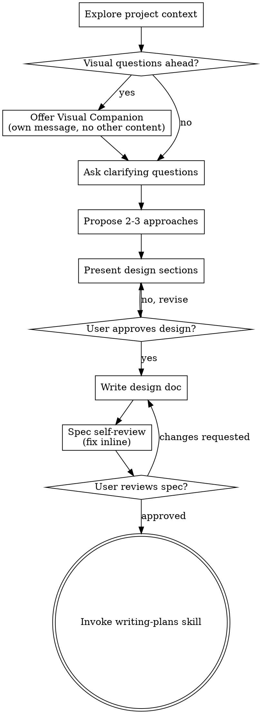

# Brainstorming Ideas Into Designs

Help turn ideas into fully formed designs and specs through natural collaborative dialogue.

Start by understanding the current project context, then ask questions one at a time to refine the idea. Once you understand what you're building, present the design and get user approval.

<HARD-GATE>
Do NOT invoke any implementation skill, write any code, scaffold any project, or take any implementation action until you have presented a design and the user has approved it. This applies to EVERY project regardless of perceived simplicity.
</HARD-GATE>

## Anti-Pattern: "This Is Too Simple To Need A Design"

Every project goes through this process. A todo list, a single-function utility, a config change — all of them. "Simple" projects are where unexamined assumptions cause the most wasted work. The design can be short (a few sentences for truly simple projects), but you MUST present it and get approval.

## Checklist

You MUST create a task for each of these items and complete them in order:

1. **Explore project context** — check files, docs, recent commits
2. **Offer visual companion** (if topic will involve visual questions) — this is its own message, not combined with a clarifying question. See the Visual Companion section below.
3. **Ask clarifying questions** — one at a time, understand purpose/constraints/success criteria
4. **Propose 2-3 approaches** — with trade-offs and your recommendation
5. **Present design** — in sections scaled to their complexity, get user approval after each section
6. **Write design doc** — save to `docs/petropowers/specs/YYYY-MM-DD-<topic>-design.md` and commit
7. **Spec self-review** — quick inline check for placeholders, contradictions, ambiguity, scope (see below)
8. **User reviews written spec** — ask user to review the spec file before proceeding
9. **Transition to implementation** — invoke writing-plans skill to create implementation plan

## Process Flow

**The terminal state is invoking writing-plans.** Do NOT invoke frontend-design, mcp-builder, or any other implementation skill. The ONLY skill you invoke after brainstorming is writing-plans.

## The Process

**Understanding the idea:**

- Check out the current project state first (files, docs, recent commits)
- Before asking detailed questions, assess scope: if the request describes multiple independent subsystems (e.g., "build a platform with chat, file storage, billing, and analytics"), flag this immediately. Don't spend questions refining details of a project that needs to be decomposed first.
- If the project is too large for a single spec, help the user decompose into sub-projects: what are the independent pieces, how do they relate, what order should they be built? Then brainstorm the first sub-project through the normal design flow. Each sub-project gets its own spec → plan → implementation cycle.
- For appropriately-scoped projects, ask questions one at a time to refine the idea
- Prefer multiple choice questions when possible, but open-ended is fine too
- Only one question per message - if a topic needs more exploration, break it into multiple questions
- Focus on understanding: purpose, constraints, success criteria

**Oil & Gas Domain Questions:**

When working on oil & gas projects, consider these domain-specific questions:

- **Data Requirements:**
  - "Will this need test data? If so, should I generate synthetic well logs, seismic data, core photos, or production data for testing?"
  - "Note: Core photo generation uses AI image generation and is expensive - always confirm count and aspects before generating"
  - "What data formats will you work with? (LAS, SEG-Y, WITSML, PRODML, DLIS)"
  - "Do you need OSDU-compliant data structures?"

- **Core Photo Requirements (if selected):**
  - "How many core photos do you need? (This is an expensive operation - each image costs API credits)"
  - "What lithology should the cores represent? (sandstone, shale, carbonate, limestone, dolomite)"
  - "Do you need specific visual features? (fractures, oil staining, bedding angles)"
  - "Do you need full geological context? (depth range, formation, field name, well metadata)"
   
- **Domain Context:**
  - "Which pipeline does this belong to? (Exploration, Drilling, Reservoir & Production, Midstream, Refining)"
  - "Who are the primary users? (Geologists, Geophysicists, Drilling Engineers, Production Engineers, Pipeline Engineers, Process Engineers)"
  - "What are the safety-critical aspects we need to consider?"

- **Physical Constraints:**
  - "Should the synthetic data follow realistic petrophysical relationships? (e.g., Archie equation for water saturation)"
  - "What lithology should the test data represent? (sandstone, shale, carbonate)"
  - "Are there specific depth ranges or basin characteristics to model?"

- **Integration Points:**
  - "Will this integrate with existing E&P software? (Petrel, Eclipse, Techlog, etc.)"
  - "Do you need real-time monitoring capabilities or batch processing?"
  - "Should this support industry standards? (API, SPE, SEG)"

Ask these questions naturally as part of the clarifying questions phase, not as a separate checklist. Only ask the questions relevant to the specific project.

**Exploring approaches:**

- Propose 2-3 different approaches with trade-offs
- Present options conversationally with your recommendation and reasoning
- Lead with your recommended option and explain why

**For oil & gas projects, consider:**
- Domain expertise vs. general-purpose solutions (when to use domain skills vs. development workflows)
- Data generation approach (synthetic data for testing vs. using sample datasets)
- Industry standards compliance (OSDU, API, SEG, SPE)
- Safety and regulatory requirements
- Integration with existing petroleum engineering software

**Presenting the design:**

- Once you believe you understand what you're building, present the design
- Scale each section to its complexity: a few sentences if straightforward, up to 200-300 words if nuanced
- Ask after each section whether it looks right so far
- Cover: architecture, components, data flow, error handling, testing
- Be ready to go back and clarify if something doesn't make sense

**Design for isolation and clarity:**

- Break the system into smaller units that each have one clear purpose, communicate through well-defined interfaces, and can be understood and tested independently
- For each unit, you should be able to answer: what does it do, how do you use it, and what does it depend on?
- Can someone understand what a unit does without reading its internals? Can you change the internals without breaking consumers? If not, the boundaries need work.
- Smaller, well-bounded units are also easier for you to work with - you reason better about code you can hold in context at once, and your edits are more reliable when files are focused. When a file grows large, that's often a signal that it's doing too much.

**Working in existing codebases:**

- Explore the current structure before proposing changes. Follow existing patterns.
- Where existing code has problems that affect the work (e.g., a file that's grown too large, unclear boundaries, tangled responsibilities), include targeted improvements as part of the design - the way a good developer improves code they're working in.
- Don't propose unrelated refactoring. Stay focused on what serves the current goal.

## After the Design

**Synthetic Data Generation (Oil & Gas Projects):**

If the project requires test data for oil & gas workflows:

1. **Identify data needs during brainstorming:** Ask about test data requirements during the clarifying questions phase
2. **Include in the spec:** Document what synthetic data will be needed (well logs, seismic, production data)
3. **Reference in the plan:** The implementation plan should include tasks for generating synthetic data using the `synthetic-data-generation` skill

**Common synthetic data scenarios:**
- Testing well log analysis → Generate LAS files with realistic GR, RHOB, NPHI, RT curves
- Testing seismic interpretation → Generate SEG-Y volumes with proper geometry
- Testing production monitoring → Generate time-series SCADA data
- OSDU integration testing → Generate data with OSDU-compliant manifests
- Demo/training environments → Generate diverse datasets representing different formations

The synthetic data skill ensures physically realistic relationships (e.g., Archie equation, density-porosity correlations) and validates against industry libraries (lasio, segyio, dlisio).

**Documentation:**

- Write the validated design (spec) to `docs/petropowers/specs/YYYY-MM-DD-<topic>-design.md`
  - (User preferences for spec location override this default)
- Use elements-of-style:writing-clearly-and-concisely skill if available
- Commit the design document to git

**Spec Self-Review:**
After writing the spec document, look at it with fresh eyes:

1. **Placeholder scan:** Any "TBD", "TODO", incomplete sections, or vague requirements? Fix them.
2. **Internal consistency:** Do any sections contradict each other? Does the architecture match the feature descriptions?
3. **Scope check:** Is this focused enough for a single implementation plan, or does it need decomposition?
4. **Ambiguity check:** Could any requirement be interpreted two different ways? If so, pick one and make it explicit.

Fix any issues inline. No need to re-review — just fix and move on.

**User Review Gate:**
After the spec review loop passes, ask the user to review the written spec before proceeding:

> "Spec written and committed to `<path>`. Please review it and let me know if you want to make any changes before we start writing out the implementation plan."

Wait for the user's response. If they request changes, make them and re-run the spec review loop. Only proceed once the user approves.

**Implementation:**

- Invoke the writing-plans skill to create a detailed implementation plan
- Do NOT invoke any other skill. writing-plans is the next step.

## Example: Oil & Gas Project Brainstorming

**User:** "I want to build a well log analysis tool"

**Agent workflow:**

1. **Explore context:** Check for existing well log code, data files
2. **Ask domain questions (one at a time):**
   - "What's the primary use case? (A) Formation evaluation (B) Quality control (C) Well correlation (D) Integration with reservoir models"
   - "Which log curves will you analyze? (A) Basic suite (GR, RHOB, NPHI) (B) Full petrophysical (add RT, DT) (C) Advanced (add spectral, imaging)"
   - "Will you need test data? I can generate synthetic LAS files with realistic petrophysical relationships for testing."
   - "Should the output be OSDU-compliant for integration with E&P platforms?"
3. **Propose approaches:**
   - Option A: Python CLI tool with lasio + numpy/pandas (recommended for flexibility)
   - Option B: Web dashboard with visualization (better for non-technical users)
   - Option C: Jupyter notebook workflow (best for exploratory analysis)
4. **Present design:** Architecture, data flow, calculations, testing approach
5. **Write spec:** Include synthetic data generation requirements
6. **Transition to planning:** Invoke writing-plans skill

**Key outcome:** The spec includes:
- Data format requirements (LAS 2.0/3.0)
- Test data plan (generate 10 LAS files: 5 sandstone, 3 shale, 2 carbonate)
- Physical constraints (Archie equation for Sw calculation)
- Validation approach (compare against lasio library)

## Key Principles

- **One question at a time** - Don't overwhelm with multiple questions
- **Multiple choice preferred** - Easier to answer than open-ended when possible
- **YAGNI ruthlessly** - Remove unnecessary features from all designs
- **Explore alternatives** - Always propose 2-3 approaches before settling
- **Incremental validation** - Present design, get approval before moving on
- **Be flexible** - Go back and clarify when something doesn't make sense

## Visual Companion

A browser-based companion for showing mockups, diagrams, and visual options during brainstorming. Available as a tool — not a mode. Accepting the companion means it's available for questions that benefit from visual treatment; it does NOT mean every question goes through the browser.

**Offering the companion:** When you anticipate that upcoming questions will involve visual content (mockups, layouts, diagrams), offer it once for consent:
> "Some of what we're working on might be easier to explain if I can show it to you in a web browser. I can put together mockups, diagrams, comparisons, and other visuals as we go. This feature is still new and can be token-intensive. Want to try it? (Requires opening a local URL)"

**This offer MUST be its own message.** Do not combine it with clarifying questions, context summaries, or any other content. The message should contain ONLY the offer above and nothing else. Wait for the user's response before continuing. If they decline, proceed with text-only brainstorming.

**Per-question decision:** Even after the user accepts, decide FOR EACH QUESTION whether to use the browser or the terminal. The test: **would the user understand this better by seeing it than reading it?**

- **Use the browser** for content that IS visual — mockups, wireframes, layout comparisons, architecture diagrams, side-by-side visual designs
- **Use the terminal** for content that is text — requirements questions, conceptual choices, tradeoff lists, A/B/C/D text options, scope decisions

A question about a UI topic is not automatically a visual question. "What does personality mean in this context?" is a conceptual question — use the terminal. "Which wizard layout works better?" is a visual question — use the browser.

If they agree to the companion, read the detailed guide before proceeding:
`skills/brainstorming/visual-companion.md`
